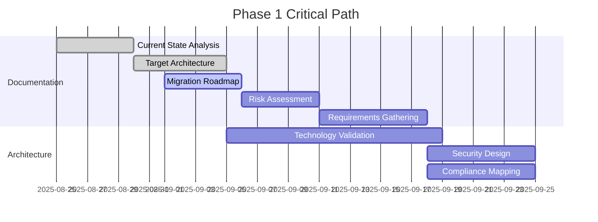
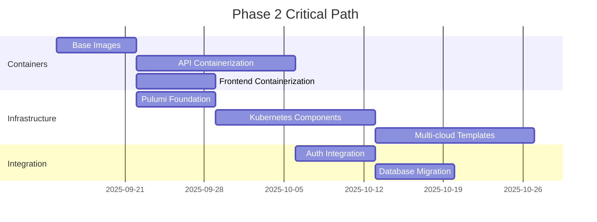
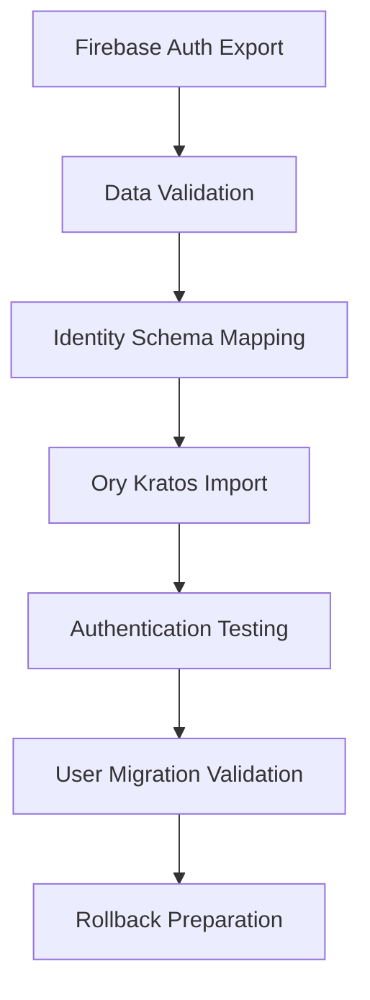
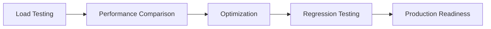

# Migration Roadmap: Resimate Cloud Migration

**Document Version**: 1.0  
**Created**: September 1, 2025  
**Last Updated**: September 1, 2025  
**Owner**: Shamail Saidi  
**Status**: Phase 1 - Planning Complete

## Executive Summary

This migration roadmap provides a detailed, phase-by-phase approach to migrating Resimate from its current Firebase/GCP architecture to a cloud-agnostic, Kubernetes-based solution. The migration follows a 24-week timeline across 4 major phases, with 5 planned customer deployments over 12-24 months.

**Key Objectives**:
- Zero-downtime migration from Firebase/GCP to cloud-agnostic architecture
- Enable customer deployments across AWS, Azure, GCP, and on-premise environments
- Maintain compliance with GDPR, HIPAA, and SOC2 requirements
- Achieve performance parity with current system

## Migration Strategy Overview

### Migration Approach: Parallel Development + Blue/Green Deployment

1. **Parallel Development**: Build new architecture alongside existing system
2. **Incremental Migration**: Migrate services in phases to minimize risk
3. **Data Synchronization**: Maintain data consistency during transition
4. **Blue/Green Deployment**: Switch traffic after validation
5. **Rollback Capability**: Maintain ability to revert at each phase

### Critical Success Factors

| Factor | Requirement | Measurement |
|--------|-------------|-------------|
| **Zero Downtime** | No service interruption > 5 minutes | SLA monitoring |
| **Data Integrity** | 100% data consistency during migration | Data validation scripts |
| **Performance Parity** | Response times within 20% of current | Load testing benchmarks |
| **Security Compliance** | Pass all compliance audits | Third-party validation |
| **User Experience** | No authentication or functionality loss | User acceptance testing |

---

## Phase 1: Foundation & Planning (Weeks 1-6)

### Objectives
- Complete architectural planning and documentation
- Establish project governance and risk management
- Validate technology choices with proof-of-concepts
- Secure stakeholder alignment and approval

### Critical Path Dependencies

### Deliverables & Timeline

| Week | Deliverable | Owner | Status | Dependencies |
|------|-------------|--------|---------|--------------|
| **Week 1** | Project charter, current state analysis | Shamail | ✅ Complete | - |
| **Week 2** | Migration roadmap, risk assessment | Shamail | 🟡 In Progress | Project charter |
| **Week 3** | Requirements documentation, compliance matrix | Shamail | ⚪ Pending | Stakeholder input |
| **Week 4** | Ory Kratos design, Knative strategy | Shamail | ⚪ Pending | Requirements |
| **Week 5** | Multi-cloud deployment guides | Shamail | ⚪ Pending | Architecture design |
| **Week 6** | Security architecture, monitoring plan | Shamail | ⚪ Pending | Compliance requirements |

### Resource Requirements
- **Technical Lead**: 40 hours/week (Shamail)
- **Client Stakeholders**: 4 hours/week (Patrick, Floyd)
- **Proof-of-Concept Environment**: AWS/GCP sandbox accounts

### Risk Mitigation
- **Documentation Risk**: Weekly reviews with stakeholders
- **Technology Risk**: Early proof-of-concept validation
- **Timeline Risk**: Parallel workstream execution

---

## Phase 2: Infrastructure Development (Weeks 7-14)

### Objectives
- Build cloud-agnostic infrastructure foundation
- Containerize all application services
- Implement Infrastructure as Code (Pulumi)
- Establish deployment automation

### Critical Path Dependencies

### Service Migration Priority

| Priority | Service | Rationale | Risk Level | Timeline |
|----------|---------|-----------|------------|----------|
| **1** | Core Model API | Business critical, complex logic | High | Week 8-9 |
| **2** | Campaigns API | Customer-facing, data intensive | Medium | Week 10-11 |
| **3** | Config/Users API | Administrative, auth dependencies | High | Week 12-13 |
| **4** | Frontend | User interface, Kratos integration | Medium | Week 13-14 |
| **5** | Database | Data migration, last to minimize downtime | High | Week 14 |

### Infrastructure Components Development

#### Week 7-8: Containerization Foundation
- **Base Container Images**
  - Python Flask base image with security hardening
  - Next.js production-optimized image
  - Multi-stage builds for minimal attack surface

#### Week 9-10: Core Infrastructure
- **Kubernetes Components** (Pulumi)
  - Cluster provisioning across clouds
  - Networking and ingress configuration
  - Storage and persistent volumes

#### Week 11-12: Service Integration
- **Authentication Services**
  - Ory Kratos deployment configuration
  - Identity schema and migration scripts
  - API authentication middleware

#### Week 13-14: Deployment Automation
- **Helm Charts and Operators**
  - Resimate platform Helm chart
  - Environment-specific configurations
  - Automated deployment pipelines

### Resource Requirements
- **DevOps Engineer**: 40 hours/week
- **Backend Developer**: 30 hours/week  
- **Cloud Infrastructure**: $2,000/month across test environments
- **Container Registry**: Private registry setup

### Quality Gates
- **Security Scan**: All containers pass security vulnerability scans
- **Performance Test**: Container startup time < 30 seconds
- **Infrastructure Validation**: Successful deployment on 2+ cloud providers
- **Integration Test**: End-to-end API functionality validation

---

## Phase 3: Migration Tools & Authentication (Weeks 15-18)

### Objectives
- Build comprehensive migration tooling
- Implement Firebase Auth to Ory Kratos migration
- Establish operational procedures
- Validate compliance requirements

### Critical Migration Components

#### Authentication Migration Strategy

### Migration Tools Development

| Tool | Purpose | Timeline | Complexity | Risk Level |
|------|---------|----------|------------|------------|
| **User Export Tool** | Firebase Auth data extraction | Week 15 | Medium | Medium |
| **Identity Mapper** | Schema transformation | Week 15 | High | High |
| **Kratos Import Tool** | Bulk user migration | Week 16 | High | High |
| **Data Sync Tool** | Real-time synchronization | Week 16 | High | Critical |
| **Validation Suite** | Migration verification | Week 17 | Medium | Medium |
| **Rollback Tool** | Emergency recovery | Week 17 | High | Critical |

#### Migration Process Flow

1. **Pre-Migration Phase** (Week 15)
   - Export all Firebase Auth users
   - Validate data integrity and completeness
   - Test identity schema mapping

2. **Parallel Operation Phase** (Week 16)
   - Deploy Ory Kratos alongside Firebase Auth
   - Sync user data in real-time
   - Test authentication flows

3. **Migration Cutover Phase** (Week 17)
   - Switch authentication traffic to Kratos
   - Validate user login functionality
   - Monitor for issues and performance

4. **Post-Migration Phase** (Week 18)
   - Complete data validation
   - Remove Firebase Auth dependencies
   - Document lessons learned

### Deployment Automation

#### Configuration Management
- **Environment Templates**: Standardized configs for dev/staging/prod
- **Secret Management**: HashiCorp Vault integration
- **Compliance Validation**: Automated compliance checking

#### Operational Tools
- **Health Monitoring**: Kubernetes readiness and liveness probes
- **Backup Automation**: Scheduled database and configuration backups
- **Log Aggregation**: Centralized logging with OpenTelemetry

### Resource Requirements
- **Migration Specialist**: 40 hours/week
- **Security Engineer**: 20 hours/week
- **Test Environment**: Full production replica
- **Data Migration Window**: 4-hour maintenance window

---

## Phase 4: Multi-Cloud Validation & Production (Weeks 19-24)

### Objectives
- Validate deployments across all target platforms
- Conduct comprehensive security and compliance testing  
- Establish production operations procedures
- Complete knowledge transfer to client

### Multi-Cloud Deployment Strategy

| Platform | Timeline | Environment | Validation Focus |
|----------|----------|-------------|------------------|
| **GCP (Baseline)** | Week 19 | GKE | Performance parity |
| **AWS** | Week 20 | EKS | Customer deployment #1 |
| **Azure** | Week 21 | AKS | Customer deployment #2-3 |
| **On-Premise** | Week 22 | Self-managed K8s | Customer deployment #4-5 |

### Validation & Testing Framework

#### Performance Benchmarking

**Performance Targets**:
- API Response Time: < 200ms (95th percentile)
- Database Query Time: < 50ms average
- Container Startup: < 30 seconds
- Horizontal Scaling: Support 10x traffic burst

#### Security & Compliance Testing

| Compliance | Testing Phase | Validation Method | Timeline |
|------------|---------------|-------------------|----------|
| **GDPR** | Week 22 | Data protection audit | External audit |
| **HIPAA** | Week 22 | Healthcare compliance review | Specialist review |
| **SOC2** | Week 23 | Controls assessment | Third-party validation |
| **Penetration Testing** | Week 23 | Security vulnerability assessment | Ethical hacking |

### Production Readiness Checklist

#### Week 19-20: Platform Validation
- [ ] **GCP Deployment**: Full system deployment on GKE
- [ ] **AWS Deployment**: Complete EKS environment setup
- [ ] **Performance Testing**: Load testing vs. baseline metrics
- [ ] **Monitoring Setup**: Full observability stack deployment

#### Week 21-22: Multi-Cloud Expansion  
- [ ] **Azure Deployment**: AKS environment with full feature parity
- [ ] **On-Premise Setup**: Self-managed Kubernetes validation
- [ ] **Cross-Platform Testing**: Consistent behavior across all platforms
- [ ] **Disaster Recovery**: Backup and restore procedures

#### Week 23-24: Production & Handover
- [ ] **Security Audits**: Complete compliance validation
- [ ] **Operations Documentation**: Runbooks and procedures
- [ ] **Knowledge Transfer**: Client team training
- [ ] **Production Cutover**: Live traffic migration

### Customer Deployment Pipeline

#### Deployment Timeline (Months 6-24)

| Month | Customer | Platform | Deployment Type | Status |
|-------|----------|----------|-----------------|---------|
| **Month 6** | Customer A | AWS EKS | Pilot deployment | Planned |
| **Month 9** | Customer B | GCP GKE | Standard deployment | Planned |
| **Month 12** | Customer C | Azure AKS | Enterprise deployment | Planned |
| **Month 18** | Customer D | Azure AKS | Multi-region deployment | Planned |
| **Month 24** | Customer E | On-Premise | Air-gapped deployment | Planned |

---

## Risk Management & Contingency Planning

### High-Risk Migration Points

#### 1. Authentication Migration (Week 16-17)
**Risk**: User authentication failure during Firebase → Kratos transition
**Impact**: Complete user lockout, business shutdown
**Mitigation**:
- Parallel authentication systems during transition
- Real-time data synchronization
- Immediate rollback capability within 15 minutes
- 24/7 monitoring during migration window

**Contingency Plan**:
- Automated rollback to Firebase Auth if error rate > 1%
- Emergency communication plan for affected users
- Customer support team on standby
- Hot-fix deployment capability

#### 2. Database Migration (Week 14)
**Risk**: Data corruption or loss during PostgreSQL migration
**Impact**: Data integrity compromise, regulatory violations
**Mitigation**:
- Full database backup before migration
- Incremental migration with validation checkpoints
- Data integrity verification at each step
- Read-only mode during active migration

**Contingency Plan**:
- Point-in-time recovery to pre-migration state
- Data validation and repair procedures
- Customer notification and remediation plan

#### 3. Multi-Cloud Performance Variance (Week 19-22)
**Risk**: Significant performance differences between cloud providers
**Impact**: Poor customer experience, SLA violations
**Mitigation**:
- Standardized performance testing across platforms
- Cloud-specific optimization parameters
- Automated scaling configurations
- Performance monitoring dashboards

### Communication & Escalation Matrix

| Risk Level | Response Time | Notification | Decision Authority |
|------------|---------------|--------------|-------------------|
| **Critical** | < 15 minutes | CEO, CTO, Project Team | CEO |
| **High** | < 1 hour | CTO, Project Lead | CTO |
| **Medium** | < 4 hours | Project Lead, Team | Project Lead |
| **Low** | < 24 hours | Team Members | Team Lead |

---

## Success Metrics & KPIs

### Technical Performance Metrics

| Metric | Current Baseline | Target | Measurement Method |
|--------|-----------------|--------|-------------------|
| **API Response Time** | 150ms average | < 200ms (95th percentile) | APM monitoring |
| **System Uptime** | 99.9% | 99.95% | SLA monitoring |
| **Database Performance** | 30ms average query | < 50ms average | Query profiling |
| **Container Startup** | N/A | < 30 seconds | Kubernetes metrics |
| **Deployment Time** | Manual (hours) | < 4 hours automated | CI/CD pipeline |

### Business Success Metrics

| Metric | Target | Timeline | Measurement |
|--------|--------|----------|-------------|
| **Customer Deployments** | 5 successful | 12-24 months | Customer feedback |
| **Platform Coverage** | 4 platforms (AWS/Azure/GCP/On-prem) | 6 months | Deployment validation |
| **Compliance Certification** | GDPR/HIPAA/SOC2 | 6 months | Third-party audit |
| **Cost Efficiency** | 20% reduction in operational costs | 12 months | Financial analysis |
| **Time to Deployment** | < 1 week for new customer | 6 months | Deployment automation |

### Migration Quality Gates

#### Phase 1 Gate (Week 6)
- [ ] 100% documentation complete
- [ ] Stakeholder sign-off on architecture
- [ ] Technology proof-of-concepts validated
- [ ] Risk mitigation plans approved

#### Phase 2 Gate (Week 14)
- [ ] All services containerized and tested
- [ ] Infrastructure deployment automated
- [ ] Multi-cloud capability validated
- [ ] Security scanning passes

#### Phase 3 Gate (Week 18)
- [ ] Authentication migration tested
- [ ] Migration tools validated
- [ ] Operational procedures documented
- [ ] Compliance requirements verified

#### Phase 4 Gate (Week 24)
- [ ] Multi-cloud deployments successful
- [ ] Performance targets achieved
- [ ] Security audits passed
- [ ] Customer handover complete

---

## Conclusion & Next Steps

This migration roadmap provides a comprehensive, risk-managed approach to transforming Resimate from a single-tenant Firebase/GCP solution to a cloud-agnostic, multi-tenant platform. The phased approach minimizes business risk while ensuring robust, scalable, and compliant deployments across multiple cloud environments.

### Immediate Action Items (Week 2)
1. **Stakeholder Review**: Present roadmap to Patrick and Floyd for approval
2. **Resource Planning**: Confirm team allocation and budget approval
3. **Risk Assessment**: Complete detailed risk register and mitigation plans
4. **Customer Communication**: Begin customer deployment timeline discussions

### Critical Dependencies for Success
- Stakeholder alignment and decision-making authority
- Access to customer cloud environments for testing
- Budget approval for multi-cloud infrastructure costs
- Technical team availability and expertise

**Document Owner**: Shamail Saidi  
**Review Cycle**: Weekly during active phases  
**Version Control**: All changes tracked in Git with stakeholder approval  
**Distribution**: Patrick (CEO), Floyd (CTO), Project Team