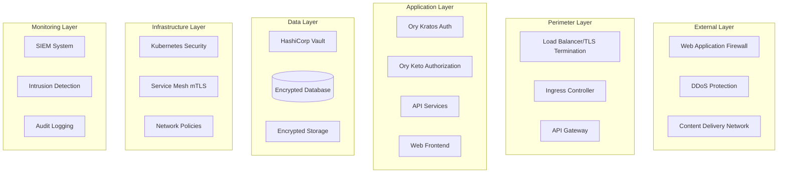
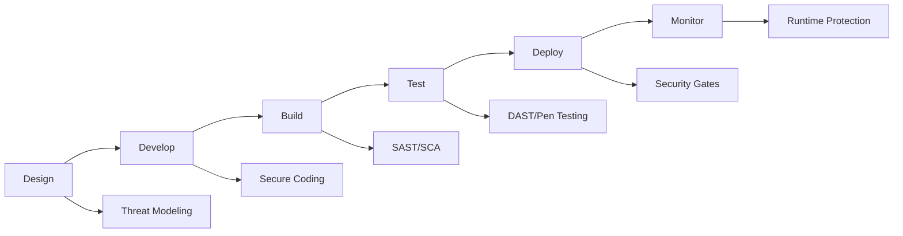

# Security Architecture Specification: Resimate Cloud Migration

**Document Version**: 1.0  
**Created**: September 1, 2025  
**Last Updated**: September 1, 2025  
**Owner**: Shamail Saidi  
**Security Lead**: TBD  
**Classification**: Confidential  

## Executive Summary

This document defines the comprehensive security architecture for Resimate's cloud-agnostic platform, implementing zero-trust principles, defense-in-depth strategies, and compliance-driven security controls across all deployment environments.

**Security Objectives**:
- **Zero-Trust Architecture**: Never trust, always verify
- **Defense in Depth**: Multiple layers of security controls
- **Compliance by Design**: GDPR, HIPAA, SOC2 built-in
- **Cloud Agnostic Security**: Consistent security across all platforms
- **Continuous Security**: DevSecOps and continuous monitoring

---

## Security Architecture Overview



---

## Zero-Trust Security Model

### Core Principles

1. **Never Trust, Always Verify**
   - All access requests authenticated and authorized
   - No implicit trust based on network location
   - Continuous verification of identity and device

2. **Least Privilege Access**
   - Minimal permissions for all identities
   - Just-in-time access provisioning
   - Regular access reviews and revocation

3. **Assume Breach**
   - Design for compromised components
   - Limit blast radius of breaches
   - Rapid detection and response

### Implementation Components

| Component | Technology | Purpose |
|-----------|------------|---------|
| **Identity Verification** | Ory Kratos + MFA | Strong authentication |
| **Device Trust** | Device certificates | Device attestation |
| **Network Segmentation** | Kubernetes NetworkPolicies | Micro-segmentation |
| **Encryption Everywhere** | mTLS, TLS 1.3 | Data protection |
| **Continuous Monitoring** | SIEM, IDS | Threat detection |

---

## Authentication and Authorization

### Multi-Factor Authentication (MFA)

```yaml
# MFA Configuration
mfa_policy:
  required_for:
    - admin_users: always
    - regular_users: risk_based
    - service_accounts: certificate_based
  
  methods:
    primary:
      - totp: Google Authenticator, Authy
      - webauthn: YubiKey, Touch ID, Windows Hello
    backup:
      - sms: Rate limited
      - recovery_codes: One-time use
  
  risk_factors:
    - new_device: require_mfa
    - unusual_location: require_mfa
    - sensitive_operation: require_mfa
    - failed_attempts > 3: require_mfa
```

### Role-Based Access Control (RBAC)

```yaml
# RBAC Matrix
roles:
  super_admin:
    permissions: ["*:*:*"]
    mfa: required_always
    session_timeout: 30m
  
  tenant_admin:
    permissions: 
      - "tenant:*:manage"
      - "users:tenant:*"
      - "data:tenant:*"
    mfa: required_always
    session_timeout: 2h
  
  analyst:
    permissions:
      - "models:tenant:read"
      - "models:tenant:write"
      - "reports:tenant:*"
    mfa: risk_based
    session_timeout: 8h
  
  viewer:
    permissions:
      - "*:tenant:read"
    mfa: optional
    session_timeout: 24h
```

---

## Network Security

### Network Segmentation

```yaml
# Kubernetes Network Policies
apiVersion: networking.k8s.io/v1
kind: NetworkPolicy
metadata:
  name: database-isolation
spec:
  podSelector:
    matchLabels:
      tier: database
  policyTypes:
  - Ingress
  - Egress
  ingress:
  - from:
    - podSelector:
        matchLabels:
          tier: backend
    ports:
    - protocol: TCP
      port: 5432
  egress:
  - to:
    - podSelector:
        matchLabels:
          tier: backup
```

### Service Mesh Security (Istio)

```yaml
# mTLS Configuration
apiVersion: security.istio.io/v1beta1
kind: PeerAuthentication
metadata:
  name: default
  namespace: resimate
spec:
  mtls:
    mode: STRICT  # Enforce mTLS for all communications

---
# Authorization Policy
apiVersion: security.istio.io/v1beta1
kind: AuthorizationPolicy
metadata:
  name: api-access
spec:
  selector:
    matchLabels:
      app: core-api
  rules:
  - from:
    - source:
        principals: ["cluster.local/ns/resimate/sa/frontend"]
    to:
    - operation:
        methods: ["GET", "POST"]
        paths: ["/api/*"]
```

---

## Data Protection

### Encryption Strategy

| Data State | Method | Key Management | Rotation |
|------------|--------|----------------|----------|
| **At Rest** | AES-256-GCM | HashiCorp Vault | 90 days |
| **In Transit** | TLS 1.3 | Cert-Manager | 30 days |
| **In Use** | Application-level | Vault Transit Engine | On-demand |
| **Backups** | AES-256-GCM | Separate KEK | 180 days |

### Key Management Architecture

```yaml
# HashiCorp Vault Configuration
vault_config:
  seal:
    type: awskms  # Or azurekeyvault, gcpckms
    key_id: "arn:aws:kms:..."
  
  storage:
    type: postgresql
    encryption: true
  
  audit:
    - type: file
      path: /vault/audit/audit.log
    - type: syslog
      facility: AUTH
      tag: vault
  
  policies:
    - database-encryption:
        path: secret/database/*
        capabilities: ["create", "read", "update"]
    
    - application-secrets:
        path: secret/application/*
        capabilities: ["read"]
    
    - transit-encryption:
        path: transit/*
        capabilities: ["encrypt", "decrypt"]
```

### Data Classification and Handling

| Classification | Description | Encryption | Access Control | Retention |
|----------------|-------------|------------|----------------|-----------|
| **Restricted** | PII, PHI, Financial | Required | Need-to-know | 7 years |
| **Confidential** | Business sensitive | Required | Role-based | 3 years |
| **Internal** | Internal operations | Recommended | Authenticated | 1 year |
| **Public** | Marketing, docs | Optional | Public | Indefinite |

---

## Application Security

### Secure Development Lifecycle



### API Security

```yaml
# API Security Configuration
api_security:
  authentication:
    type: oauth2
    provider: ory_hydra
    token_validation: strict
  
  rate_limiting:
    authenticated: 1000/hour
    unauthenticated: 100/hour
    burst: 20
  
  input_validation:
    - json_schema: strict
    - sql_injection: blocked
    - xss_prevention: enabled
    - max_request_size: 10MB
  
  cors:
    allowed_origins: ["https://*.resimate.io"]
    allowed_methods: ["GET", "POST", "PUT", "DELETE"]
    allowed_headers: ["Authorization", "Content-Type"]
    max_age: 86400
  
  security_headers:
    X-Frame-Options: DENY
    X-Content-Type-Options: nosniff
    X-XSS-Protection: "1; mode=block"
    Strict-Transport-Security: "max-age=31536000; includeSubDomains"
    Content-Security-Policy: "default-src 'self'"
```

---

## Container and Kubernetes Security

### Container Security

```dockerfile
# Secure Container Best Practices
FROM gcr.io/distroless/python3-debian11

# Run as non-root user
USER nonroot:nonroot

# Read-only root filesystem
# Defined in Kubernetes SecurityContext

# No unnecessary packages or tools
# Distroless base image

# Security scanning in CI/CD
# Trivy, Snyk, or Twistlock scanning
```

### Kubernetes Security Policies

```yaml
# Pod Security Policy
apiVersion: policy/v1beta1
kind: PodSecurityPolicy
metadata:
  name: restricted
spec:
  privileged: false
  allowPrivilegeEscalation: false
  requiredDropCapabilities:
    - ALL
  volumes:
    - 'configMap'
    - 'emptyDir'
    - 'projected'
    - 'secret'
    - 'downwardAPI'
    - 'persistentVolumeClaim'
  runAsUser:
    rule: 'MustRunAsNonRoot'
  seLinux:
    rule: 'RunAsAny'
  fsGroup:
    rule: 'RunAsAny'
  readOnlyRootFilesystem: true
```

---

## Security Monitoring and Incident Response

### Security Information and Event Management (SIEM)

```yaml
# SIEM Event Collection
siem_configuration:
  event_sources:
    - kubernetes_audit_logs
    - application_logs
    - network_flow_logs
    - authentication_events
    - authorization_decisions
    - database_queries
    - api_access_logs
  
  correlation_rules:
    - brute_force_detection:
        condition: failed_login > 5 in 5_minutes
        action: block_ip, alert_security
    
    - privilege_escalation:
        condition: role_change to admin
        action: audit, require_mfa
    
    - data_exfiltration:
        condition: large_data_transfer > 1GB
        action: alert, investigate
  
  retention:
    hot_storage: 30_days
    warm_storage: 90_days
    cold_storage: 7_years
```

### Incident Response Plan

| Phase | Activities | Responsible | SLA |
|-------|------------|-------------|-----|
| **Detection** | Monitor alerts, analyze events | SOC Team | < 15 min |
| **Triage** | Assess severity, initial investigation | Security Lead | < 30 min |
| **Containment** | Isolate affected systems | DevOps Team | < 1 hour |
| **Eradication** | Remove threat, patch vulnerabilities | Engineering | < 4 hours |
| **Recovery** | Restore services, validate | Operations | < 8 hours |
| **Lessons Learned** | Post-mortem, improvements | All Teams | < 1 week |

---

## Compliance and Audit

### Audit Logging Requirements

```yaml
# Comprehensive Audit Configuration
audit_requirements:
  events_to_log:
    - authentication_attempts
    - authorization_decisions
    - data_access
    - configuration_changes
    - administrative_actions
    - security_events
  
  log_format:
    timestamp: ISO8601
    user_id: UUID
    session_id: UUID
    action: string
    resource: string
    result: success/failure
    ip_address: string
    user_agent: string
  
  integrity:
    signing: HMAC-SHA256
    chain: blockchain_optional
    immutable_storage: true
  
  retention:
    compliance_logs: 7_years
    security_logs: 1_year
    operational_logs: 90_days
```

### Compliance Controls Mapping

| Framework | Control | Implementation | Evidence |
|-----------|---------|----------------|----------|
| **GDPR** | Encryption | AES-256 everywhere | Encryption audit |
| **HIPAA** | Access Controls | RBAC + MFA | Access logs |
| **SOC2** | Change Management | GitOps + approval workflow | Git history |
| **PCI DSS** | Network Segmentation | K8s NetworkPolicies | Network diagram |

---

## Security Testing and Validation

### Security Testing Framework

```yaml
# Security Testing Pipeline
security_testing:
  static_analysis:
    - tool: SonarQube
      threshold: No critical/high
    - tool: Semgrep
      rules: OWASP Top 10
  
  dependency_scanning:
    - tool: Snyk
      threshold: No critical vulnerabilities
    - tool: OWASP Dependency Check
      frequency: Every build
  
  container_scanning:
    - tool: Trivy
      threshold: No critical/high
    - tool: Clair
      frequency: Every build
  
  dynamic_testing:
    - tool: OWASP ZAP
      frequency: Weekly
    - tool: Burp Suite
      frequency: Monthly
  
  penetration_testing:
    frequency: Quarterly
    scope: Full application
    provider: Third-party
```

---

## Disaster Recovery and Business Continuity

### Security During Disasters

```yaml
# DR Security Procedures
disaster_recovery:
  backup_security:
    encryption: AES-256
    key_escrow: Separate location
    testing: Monthly restore test
  
  failover_security:
    authentication: Maintained
    authorization: Replicated
    audit_continuity: Preserved
  
  recovery_validation:
    security_scan: Required
    access_review: Required
    compliance_check: Required
```

---

## Security Metrics and KPIs

| Metric | Target | Current | Status |
|--------|---------|---------|---------|
| **Mean Time to Detect (MTTD)** | < 1 hour | TBD | 🟡 |
| **Mean Time to Respond (MTTR)** | < 4 hours | TBD | 🟡 |
| **Vulnerability Remediation** | < 30 days | TBD | 🟡 |
| **Security Training Completion** | 100% | TBD | 🟡 |
| **Patch Compliance** | > 95% | TBD | 🟡 |
| **Failed Authentication Rate** | < 1% | TBD | 🟡 |

---

## Security Governance

### Security Roles and Responsibilities

| Role | Responsibilities | Authority |
|------|------------------|-----------|
| **CISO** | Overall security strategy | Policy approval |
| **Security Architect** | Security design and standards | Design approval |
| **Security Engineer** | Implementation and operations | Change implementation |
| **SOC Analyst** | Monitoring and response | Incident handling |
| **Compliance Officer** | Regulatory compliance | Audit coordination |

### Security Review Process

1. **Design Review**: Threat modeling for new features
2. **Code Review**: Security-focused code review
3. **Pre-Deployment**: Security gate validation
4. **Post-Deployment**: Security monitoring
5. **Periodic Review**: Quarterly security assessment

---

## Conclusion

This security architecture provides comprehensive protection for Resimate's cloud-agnostic platform through:

1. **Zero-trust principles** ensuring continuous verification
2. **Defense in depth** with multiple security layers
3. **Compliance by design** meeting regulatory requirements
4. **Continuous security** through DevSecOps practices
5. **Incident readiness** with defined response procedures

The architecture will be continuously reviewed and updated to address evolving threats and requirements.

**Document Owner**: Shamail Saidi  
**Review Cycle**: Quarterly  
**Next Review**: December 1, 2025  
**Distribution**: Security Team, Engineering, Compliance