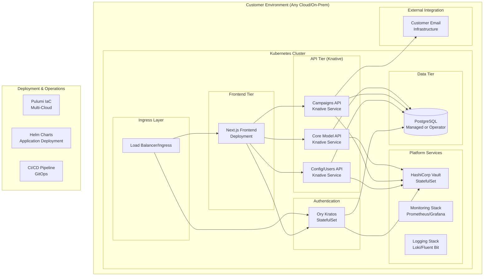
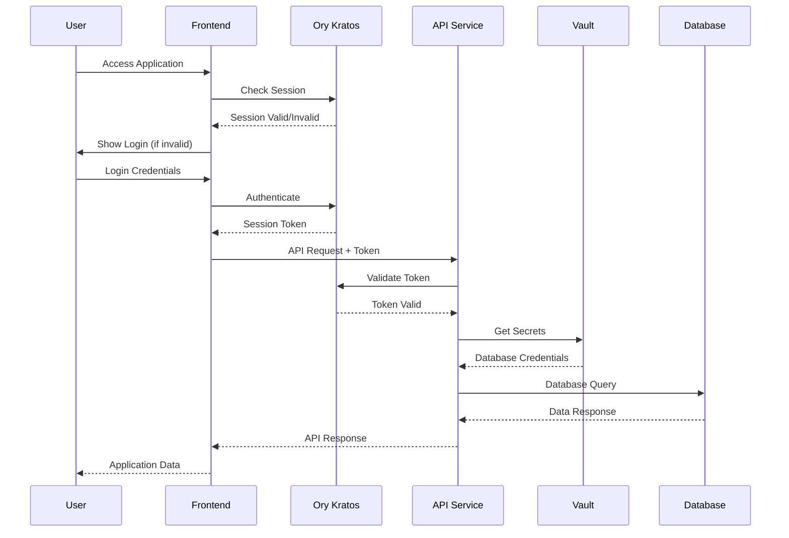

# Target Architecture: Cloud-Agnostic Resimate Platform

**Document Version**: 1.0  
**Date**: September 1, 2025  
**Architecture Pattern**: Kubernetes-native, Cloud-agnostic Microservices

## Executive Summary

The target architecture transforms Resimate from a GCP/Firebase-dependent platform to a cloud-agnostic, Kubernetes-native solution deployable across AWS, Azure, GCP, and on-premise environments. The design maintains the existing microservices structure while replacing proprietary services with open-source, standardized alternatives.

## Architecture Principles

### 1. Cloud Abstraction
- **Kubernetes as Universal Platform**: Single deployment target across all clouds
- **Standard APIs**: Use Kubernetes-native resources and standard protocols
- **Portable Storage**: Cloud-managed databases with fallback to operators
- **Provider Independence**: No cloud-specific services in application layer

### 2. Operational Excellence  
- **Infrastructure as Code**: Pulumi for reproducible deployments
- **Observability**: Comprehensive monitoring and logging
- **Security by Design**: Zero-trust networking and RBAC
- **Compliance Ready**: Built-in controls for GDPR, HIPAA, SOC2

### 3. Developer Experience
- **Serverless Feel**: Knative for scale-to-zero and event-driven APIs
- **Simple Deployments**: Single command deployment across environments
- **Local Development**: Complete stack runnable on developer machines
- **GitOps Ready**: Configuration and deployment through version control

## Target Architecture Overview



## Component Architecture

### Frontend Tier

#### Next.js Frontend
**Technology**: Next.js (Containerized)  
**Deployment**: Kubernetes Deployment + HorizontalPodAutoscaler  
**Scaling**: 2-10 replicas based on CPU/memory usage  

```yaml
# Frontend Resource Configuration
Resources:
  Requests: 512Mi memory, 250m CPU
  Limits: 1Gi memory, 1000m CPU
  Replicas: 2-10 (auto-scaling)
```

**Key Changes from Current**:
- Containerized deployment (vs Firebase Hosting)
- Ory Kratos SDK integration (vs Firebase Auth)
- Environment-specific configuration injection
- Health checks and readiness probes

### Authentication Tier

#### Ory Kratos Identity Management
**Technology**: Ory Kratos  
**Deployment**: StatefulSet (for session persistence)  
**Database**: Dedicated PostgreSQL schema  

**Capabilities**:
- **Identity Management**: User registration, login, profile management
- **Multi-Factor Authentication**: TOTP, WebAuthn support
- **Self-Service Flows**: Registration, login, recovery, verification
- **Admin API**: User management and identity operations
- **Webhook Integration**: Custom business logic integration

```yaml
# Kratos Configuration Structure
kratos:
  identity:
    default_schema_id: "user_v1"
    schemas:
      - id: "user_v1"
        url: "file:///etc/config/identity.schema.json"
  selfservice:
    flows:
      registration:
        enabled: true
        ui_url: "https://app.customer.com/auth/registration"
      login:
        enabled: true
        ui_url: "https://app.customer.com/auth/login"
```

**Migration Path**: Firebase Auth users exported and imported via Kratos Admin API

### API Tier (Knative Services)

#### Serverless API Architecture  
**Platform**: Knative Serving on Kubernetes  
**Benefits**: Scale-to-zero, request-based scaling, event-driven  

#### 1. Core Model API (Knative Service)
**Technology**: Python Flask (Containerized)  
**Scaling**: 0-50 replicas, target 70% CPU utilization  
**Use Cases**: Resilience model CRUD, calculations, business logic  

```yaml
apiVersion: serving.knative.dev/v1
kind: Service
metadata:
  name: core-model-api
spec:
  template:
    spec:
      containers:
      - image: resimate/core-model-api:latest
        env:
        - name: DATABASE_URL
          valueFrom:
            secretKeyRef:
              name: postgres-credentials
              key: url
        - name: VAULT_ADDR
          value: "http://vault.vault-system:8200"
      containerConcurrency: 100
    metadata:
      annotations:
        autoscaling.knative.dev/minScale: "0"
        autoscaling.knative.dev/maxScale: "50"
        autoscaling.knative.dev/target: "70"
```

#### 2. Campaigns API (Knative Service)  
**Scaling**: 0-25 replicas (lower expected load)  
**Event Integration**: Kubernetes events for campaign triggers  
**Email Integration**: Direct SMTP or customer email service API  

#### 3. Config/Users API (Knative Service)
**Scaling**: 0-10 replicas (administrative operations)  
**Access Pattern**: Lower frequency, higher privilege operations  
**Security**: Enhanced RBAC for administrative functions  

### Data Tier

#### PostgreSQL Database Strategy
**Multi-Cloud Approach**:

| Platform | Primary Option | Fallback Option |
|----------|---------------|-----------------|
| **AWS** | RDS PostgreSQL | PostgreSQL Operator |
| **Azure** | Azure Database for PostgreSQL | PostgreSQL Operator |
| **GCP** | Cloud SQL PostgreSQL | PostgreSQL Operator |
| **On-Premise** | PostgreSQL Operator | Self-managed PostgreSQL |

**Database Schema Design**:
```sql
-- Tenant isolation maintained through schemas
CREATE SCHEMA tenant_resimate_main;
CREATE SCHEMA kratos_identities;  
CREATE SCHEMA vault_storage;

-- Application schemas per tenant
tenant_resimate_main.resilience_models
tenant_resimate_main.campaigns
tenant_resimate_main.configurations
tenant_resimate_main.users

-- Identity management schema  
kratos_identities.identities
kratos_identities.sessions
kratos_identities.flows

-- Vault backend storage (if using PostgreSQL backend)
vault_storage.vault_kv_store
```

### Platform Services

#### HashiCorp Vault (Secrets Management)
**Deployment**: StatefulSet with persistent volumes  
**High Availability**: 3-node cluster with Raft storage  
**Integration**: Kubernetes service account authentication  

**Secrets Organization**:
```
vault/
├── database/
│   ├── postgres-credentials
│   └── readonly-credentials  
├── external/
│   ├── email-service-api-key
│   └── third-party-integrations
├── kubernetes/
│   └── service-account-tokens
└── certificates/
    ├── tls-certificates
    └── ca-certificates
```

#### Monitoring Stack
**Components**:
- **Prometheus**: Metrics collection and alerting
- **Grafana**: Visualization and dashboards  
- **AlertManager**: Alert routing and management
- **Node Exporter**: Infrastructure metrics

**Custom Metrics**:
- API response times and error rates
- Database connection pool utilization  
- Campaign execution success rates
- User authentication patterns

#### Logging Stack
**Components**:
- **Fluent Bit**: Log collection and forwarding
- **Loki**: Log aggregation and storage
- **Grafana**: Log visualization and analysis

**Log Aggregation Strategy**:
```yaml
# Structured logging format
{
  "timestamp": "2025-09-01T12:00:00Z",
  "service": "core-model-api",
  "level": "INFO", 
  "tenant": "customer-abc",
  "user_id": "uuid",
  "operation": "create_resilience_model",
  "duration_ms": 245,
  "message": "Resilience model created successfully"
}
```

## Multi-Cloud Deployment Patterns

### Cloud Provider Integration

#### AWS Deployment
```yaml
# AWS-specific components
Load Balancer: Application Load Balancer (ALB)
Kubernetes: Elastic Kubernetes Service (EKS)
Database: RDS PostgreSQL Multi-AZ
Storage: EBS volumes for persistent data
Networking: VPC with private/public subnets
DNS: Route 53 integration
Certificates: ACM for TLS certificates
```

#### Azure Deployment  
```yaml
# Azure-specific components
Load Balancer: Application Gateway
Kubernetes: Azure Kubernetes Service (AKS)
Database: Azure Database for PostgreSQL Flexible Server
Storage: Azure Disk for persistent volumes
Networking: Virtual Network with subnets
DNS: Azure DNS integration
Certificates: Key Vault certificates
```

#### GCP Deployment
```yaml
# GCP-specific components  
Load Balancer: Cloud Load Balancing
Kubernetes: Google Kubernetes Engine (GKE)
Database: Cloud SQL for PostgreSQL
Storage: Persistent Disk
Networking: VPC with subnetworks
DNS: Cloud DNS integration
Certificates: Certificate Manager
```

#### On-Premise Deployment
```yaml
# On-premise components
Load Balancer: HAProxy or NGINX Ingress
Kubernetes: RKE2, K3s, or vanilla Kubernetes
Database: PostgreSQL with streaming replication
Storage: Local storage or SAN/NAS integration
Networking: Customer network infrastructure  
DNS: Customer DNS servers
Certificates: Customer CA or Let's Encrypt
```

## Security Architecture

### Network Security
```yaml
Network Policies:
  - Default deny all traffic
  - Allow frontend → APIs 
  - Allow APIs → database
  - Allow APIs → vault
  - Deny direct external → database
  - Deny direct external → vault
```

### Authentication & Authorization Flow


### Compliance Controls

#### GDPR Compliance
- **Data Minimization**: Only collect necessary user data
- **Right to be Forgotten**: User data deletion workflows
- **Data Portability**: User data export functionality  
- **Privacy by Design**: Default privacy settings
- **Audit Logging**: All data access operations logged

#### HIPAA Compliance  
- **Access Controls**: Role-based access with least privilege
- **Audit Logs**: All PHI access tracked and immutable
- **Encryption**: Data encrypted at rest and in transit
- **Backup Security**: Encrypted backups with access controls
- **Incident Response**: Automated security incident detection

#### SOC2 Compliance
- **Monitoring**: Comprehensive system monitoring
- **Change Management**: All changes tracked and approved
- **Vulnerability Management**: Regular security scanning
- **Incident Management**: Security incident response procedures
- **Access Management**: Periodic access reviews and revocation

## Performance & Scaling

### Scaling Characteristics

| Component | Min Replicas | Max Replicas | Scaling Trigger |
|-----------|-------------|-------------|-----------------|
| **Frontend** | 2 | 10 | CPU > 70%, Memory > 80% |
| **Core Model API** | 0 | 50 | Request queue depth |
| **Campaigns API** | 0 | 25 | Request queue depth |
| **Config/Users API** | 0 | 10 | Request queue depth |
| **Ory Kratos** | 2 | 5 | CPU > 60% |
| **Vault** | 3 | 3 | No auto-scaling (HA cluster) |

### Resource Allocation

```yaml
Resource Requests/Limits:
  frontend:
    requests: 512Mi memory, 250m CPU
    limits: 1Gi memory, 1000m CPU
  
  api-services:
    requests: 256Mi memory, 100m CPU  
    limits: 512Mi memory, 500m CPU
    
  kratos:
    requests: 512Mi memory, 250m CPU
    limits: 1Gi memory, 500m CPU
    
  vault:
    requests: 1Gi memory, 500m CPU
    limits: 2Gi memory, 1000m CPU
    
  postgresql:
    requests: 2Gi memory, 1000m CPU
    limits: 4Gi memory, 2000m CPU
```

## Migration Benefits

### Operational Benefits
✅ **Multi-Cloud Portability**: Deploy anywhere Kubernetes runs  
✅ **Cost Optimization**: Pay only for actual resource usage  
✅ **Vendor Independence**: No lock-in to specific cloud providers  
✅ **Automated Operations**: Infrastructure and application automation  
✅ **Consistent Environments**: Same stack across dev/staging/prod  

### Security Benefits  
✅ **Zero-Trust Architecture**: Network segmentation and service mesh  
✅ **Secrets Management**: Centralized, encrypted secrets storage  
✅ **Compliance Ready**: Built-in controls for regulatory requirements  
✅ **Audit Trails**: Comprehensive logging and monitoring  
✅ **Identity Management**: Modern, standard-based authentication  

### Developer Benefits
✅ **Local Development**: Complete stack on laptop/workstation  
✅ **Rapid Deployment**: Single command deployments  
✅ **Observability**: Rich metrics, logs, and tracing  
✅ **Standard Tools**: Industry-standard Kubernetes ecosystem  
✅ **GitOps Workflows**: Configuration and deployment through Git  

## Conclusion

The target architecture provides Resimate with a modern, cloud-agnostic platform that maintains current functionality while enabling deployment across multiple cloud providers and on-premise environments. The Kubernetes-native design ensures consistency and portability while the choice of standard, open-source components eliminates vendor lock-in and reduces operational complexity.

**Key Architectural Decisions**:
1. **Kubernetes** as the universal deployment platform
2. **Knative** for serverless API experience  
3. **Ory Kratos** for modern identity management
4. **HashiCorp Vault** for secrets management
5. **PostgreSQL** for portable data persistence
6. **Pulumi** for infrastructure automation

This architecture enables Resimate to serve enterprise customers with strict deployment requirements while maintaining operational efficiency and development velocity.