# Compliance Requirements Matrix: Resimate Cloud Migration

**Document Version**: 1.0  
**Created**: September 1, 2025  
**Last Updated**: September 1, 2025  
**Owner**: Shamail Saidi  
**Compliance Review Date**: Quarterly  

## Executive Summary

This document defines comprehensive compliance requirements for the Resimate cloud migration across GDPR, HIPAA, and SOC2 frameworks. As a security consultancy handling sensitive business and healthcare data, Resimate must maintain the highest standards of data protection and regulatory compliance across all deployment environments.

**Compliance Scope**:
- **GDPR**: EU data subjects and European customer deployments
- **HIPAA**: Healthcare customers and Protected Health Information (PHI)
- **SOC2**: Security, availability, and confidentiality controls for all customers

**Compliance Status Overview**:
| Regulation | Requirements | Implementation Status | Target Completion |
|------------|--------------|----------------------|------------------|
| **GDPR** | 47 requirements | 🟡 65% designed | Week 22 |
| **HIPAA** | 34 requirements | 🟡 60% designed | Week 22 |
| **SOC2** | 28 requirements | 🟡 45% designed | Week 23 |

---

## Regulatory Framework Overview

### GDPR (General Data Protection Regulation)
**Scope**: EU residents' personal data processing
**Penalties**: Up to €20M or 4% of annual global turnover
**Key Principles**: Lawfulness, fairness, transparency, data minimization, accuracy, storage limitation, integrity, confidentiality, accountability

### HIPAA (Health Insurance Portability and Accountability Act)
**Scope**: Protected Health Information (PHI) in healthcare contexts
**Penalties**: Up to $1.5M per incident
**Key Requirements**: Administrative, physical, and technical safeguards for PHI

### SOC2 (System and Organization Controls 2)
**Scope**: Security, availability, processing integrity, confidentiality, privacy
**Purpose**: Customer assurance on data handling and system security
**Framework**: Five Trust Service Criteria with detailed controls

---

## GDPR Compliance Requirements

### Article 25: Data Protection by Design and Default

| Requirement ID | Article/Recital | Requirement | Implementation Status | Technical Implementation | Priority |
|----------------|-----------------|-------------|----------------------|-------------------------|----------|
| **GDPR-001** | Art. 25(1) | Privacy by design implementation | 🟡 In Progress | Ory Kratos privacy-first architecture | High |
| **GDPR-002** | Art. 25(2) | Data minimization by default | ⚪ Not Started | Data collection governance | High |
| **GDPR-003** | Art. 25(3) | Appropriate technical measures | 🟡 In Progress | Encryption, pseudonymization | Critical |

**Technical Implementation**:
- **Data Minimization**: Automated data classification and retention policies
- **Privacy by Design**: Default privacy settings in Ory Kratos identity schema  
- **Technical Measures**: End-to-end encryption, data anonymization capabilities

### Article 30: Records of Processing Activities

| Requirement ID | Implementation | Status | Owner | Due Date |
|----------------|----------------|---------|--------|----------|
| **GDPR-004** | Processing activity register | 🟡 In Progress | DPO | Week 20 |
| **GDPR-005** | Data mapping documentation | ⚪ Not Started | Data Architect | Week 21 |
| **GDPR-006** | Retention schedule documentation | ⚪ Not Started | Legal/Compliance | Week 21 |

### Article 32: Security of Processing

| Security Measure | GDPR Requirement | Technical Implementation | Status |
|------------------|------------------|-------------------------|---------|
| **Encryption** | Art. 32(1)(a) | TLS 1.3, AES-256, key rotation | 🟡 In Progress |
| **Integrity** | Art. 32(1)(b) | Digital signatures, audit logs | ⚪ Not Started |
| **Availability** | Art. 32(1)(b) | Multi-cloud redundancy, backup | 🟡 In Progress |
| **Resilience** | Art. 32(1)(b) | Disaster recovery, incident response | ⚪ Not Started |

### Data Subject Rights (Articles 15-22)

| Right | Article | Implementation Requirement | Technical Solution | Status |
|-------|---------|---------------------------|-------------------|---------|
| **Access** | Art. 15 | Automated data export | Ory Kratos data export API | 🟡 In Progress |
| **Rectification** | Art. 16 | Data correction workflows | User profile management | 🟡 In Progress |
| **Erasure** | Art. 17 | Right to be forgotten | Automated data deletion | ⚪ Not Started |
| **Portability** | Art. 20 | Data export in common formats | JSON/CSV export functionality | ⚪ Not Started |
| **Object** | Art. 21 | Opt-out mechanisms | Consent management system | ⚪ Not Started |

### Cross-Border Data Transfers (Chapter V)

| Transfer Mechanism | Requirement | Implementation | Status |
|-------------------|-------------|----------------|---------|
| **Adequacy Decisions** | Art. 45 | UK, Switzerland deployment options | 🟡 Planned |
| **Standard Contractual Clauses** | Art. 46(2)(c) | Customer contract templates | ⚪ Not Started |
| **Binding Corporate Rules** | Art. 47 | Internal data transfer policies | ⚪ Not Started |

---

## HIPAA Compliance Requirements

### Administrative Safeguards (45 CFR §164.308)

| Standard | Implementation Specification | Requirement | Technical Solution | Status |
|----------|----------------------------|-------------|-------------------|---------|
| **§164.308(a)(1)** | Security Officer | Assigned security responsibility | Role-based access controls | ✅ Complete |
| **§164.308(a)(2)** | Assigned Security Responsibility | Workforce access management | Ory Kratos RBAC | 🟡 In Progress |
| **§164.308(a)(3)** | Workforce Training | Security awareness training | Training management system | ⚪ Not Started |
| **§164.308(a)(4)** | Information Access Management | Access authorization procedures | Identity governance | 🟡 In Progress |
| **§164.308(a)(5)** | Access Control | Unique user identification | Multi-factor authentication | 🟡 In Progress |

### Physical Safeguards (45 CFR §164.310)

| Standard | Requirement | Multi-Cloud Implementation | Status |
|----------|-------------|---------------------------|---------|
| **§164.310(a)(1)** | Facility Access Controls | Cloud provider data center security | ✅ Inherited |
| **§164.310(a)(2)(i)** | Workstation Use | Secure remote access policies | 🟡 In Progress |
| **§164.310(a)(2)(ii)** | Device and Media Controls | Encrypted storage, secure disposal | 🟡 In Progress |

### Technical Safeguards (45 CFR §164.312)

| Standard | Implementation | Technical Details | Status |
|----------|----------------|-------------------|---------|
| **§164.312(a)(1)** | Access Control | Role-based PHI access | Ory Kratos + custom authorization | 🟡 In Progress |
| **§164.312(a)(2)(i)** | Unique User Identification | Individual user accounts | Ory Kratos identity management | 🟡 In Progress |
| **§164.312(a)(2)(ii)** | Emergency Access | Break-glass procedures | Emergency access workflows | ⚪ Not Started |
| **§164.312(a)(2)(iii)** | Automatic Logoff | Session timeout controls | Configurable session policies | ⚪ Not Started |
| **§164.312(b)** | Audit Controls | Comprehensive audit logging | OpenTelemetry + audit trail | 🟡 In Progress |
| **§164.312(c)(1)** | Integrity | Data integrity verification | Cryptographic checksums | ⚪ Not Started |
| **§164.312(d)** | Person or Entity Authentication | Strong authentication | MFA + biometrics support | 🟡 In Progress |
| **§164.312(e)(1)** | Transmission Security | Encrypted data transmission | TLS 1.3, VPN, encrypted APIs | 🟡 In Progress |

### HIPAA Risk Assessment Matrix

| Risk Area | Probability | Impact | Risk Level | Mitigation Strategy |
|-----------|-------------|---------|------------|-------------------|
| **Data Breach** | Medium | Critical | 🔴 High | Encryption, access controls, monitoring |
| **Insider Threat** | Low | High | 🟡 Medium | RBAC, audit logging, background checks |
| **System Compromise** | Medium | High | 🔴 High | Security hardening, patch management |
| **Data Loss** | Low | Critical | 🟡 Medium | Backup strategy, disaster recovery |

---

## SOC2 Compliance Requirements

### Security (CC1-CC3)

| Control | Trust Service Criteria | Implementation | Status |
|---------|------------------------|----------------|---------|
| **CC1.1** | Control environment integrity | Security governance framework | 🟡 In Progress |
| **CC1.2** | Board oversight | Executive security committee | ✅ Complete |
| **CC1.3** | Management philosophy | Security-first culture | ✅ Complete |
| **CC2.1** | Communication objectives | Security policy documentation | 🟡 In Progress |
| **CC2.2** | Risk management | Risk assessment process | ✅ Complete |
| **CC3.1** | Monitoring activities | Security monitoring tools | 🟡 In Progress |

### Availability (A1)

| Control | Requirement | Implementation | Target |
|---------|-------------|----------------|---------|
| **A1.1** | Performance monitoring | Real-time system monitoring | 99.95% uptime |
| **A1.2** | Capacity management | Auto-scaling, resource optimization | Dynamic scaling |
| **A1.3** | System recovery | Disaster recovery procedures | < 4 hour RTO |

### Processing Integrity (PI1)

| Control | Data Integrity Measure | Technical Implementation | Status |
|---------|------------------------|-------------------------|---------|
| **PI1.1** | Data input controls | API validation, sanitization | 🟡 In Progress |
| **PI1.2** | Data processing controls | Transaction integrity, checksums | ⚪ Not Started |
| **PI1.3** | Data output controls | Output validation, formatting | ⚪ Not Started |

### Confidentiality (C1)

| Control | Confidentiality Measure | Implementation | Status |
|---------|------------------------|----------------|---------|
| **C1.1** | Data classification | Automated data classification | ⚪ Not Started |
| **C1.2** | Access restrictions | Encryption, access controls | 🟡 In Progress |
| **C1.3** | Disposal procedures | Secure data deletion | ⚪ Not Started |

### Privacy (P1-P9) - If Applicable

| Control | Privacy Requirement | Implementation | Status |
|---------|-------------------|----------------|---------|
| **P1.0** | Privacy notice | Customer data handling disclosure | ⚪ Not Started |
| **P2.0** | Choice and consent | Granular consent management | ⚪ Not Started |
| **P3.0** | Collection limitations | Data minimization policies | ⚪ Not Started |

---

## Implementation Roadmap

### Phase 1: Foundation (Weeks 1-6) - Current
- [x] Compliance requirements analysis
- [x] Privacy impact assessment
- [ ] Data mapping and classification
- [ ] Compliance architecture review

### Phase 2: Technical Implementation (Weeks 7-18)
- [ ] Encryption implementation (TLS 1.3, AES-256)
- [ ] Access control system (Ory Kratos RBAC)
- [ ] Audit logging system (OpenTelemetry)
- [ ] Data retention and deletion policies

### Phase 3: Testing and Validation (Weeks 19-22)
- [ ] Compliance testing procedures
- [ ] Internal audit and gap analysis
- [ ] Remediation of identified issues
- [ ] Documentation finalization

### Phase 4: External Audit (Weeks 23-24)
- [ ] Third-party compliance audit
- [ ] Audit finding remediation
- [ ] Compliance certification
- [ ] Ongoing monitoring setup

---

## Technical Architecture for Compliance

### Data Protection Architecture

```mermaid
graph TB
    subgraph "Data Protection Layer"
        A[Data Classification] --> B[Encryption at Rest]
        B --> C[Encryption in Transit]
        C --> D[Access Controls]
        D --> E[Audit Logging]
    end
    
    subgraph "Identity & Access Management"
        F[Ory Kratos] --> G[Multi-Factor Auth]
        G --> H[Role-Based Access]
        H --> I[Session Management]
    end
    
    subgraph "Monitoring & Compliance"
        J[Real-time Monitoring] --> K[Compliance Dashboards]
        K --> L[Automated Reporting]
        L --> M[Incident Response]
    end
```

### Encryption Strategy

| Data State | Encryption Method | Key Management | Implementation |
|------------|------------------|----------------|----------------|
| **Data at Rest** | AES-256-GCM | HashiCorp Vault | Database TDE, file system encryption |
| **Data in Transit** | TLS 1.3 | Certificate management | API endpoints, inter-service communication |
| **Data in Use** | Application-level | Vault secrets | Sensitive field encryption |

### Access Control Framework

| Layer | Technology | Implementation | Compliance Mapping |
|-------|------------|----------------|-------------------|
| **Authentication** | Ory Kratos | MFA, SSO, identity federation | HIPAA §164.312(d) |
| **Authorization** | Ory Keto | Fine-grained permissions | GDPR Art. 32, SOC2 CC6.1 |
| **Network** | Kubernetes Network Policies | Micro-segmentation | SOC2 CC6.1 |
| **Application** | Custom RBAC | Business logic authorization | HIPAA §164.308(a)(4) |

---

## Compliance Monitoring and Reporting

### Automated Compliance Monitoring

| Compliance Area | Monitoring Method | Alert Threshold | Response Time |
|-----------------|------------------|----------------|---------------|
| **Data Access** | Real-time audit logs | Unusual access patterns | 15 minutes |
| **Encryption** | Certificate monitoring | 30 days before expiry | 24 hours |
| **Backup Integrity** | Automated validation | Backup failure | 1 hour |
| **Access Reviews** | Quarterly automated reports | Overdue reviews | 48 hours |

### Compliance Dashboards

#### Executive Dashboard KPIs
- Compliance posture score (target: 95%+)
- Outstanding audit findings (target: 0)
- Data breach risk level (target: Low)
- Regulatory update compliance (target: 100%)

#### Technical Dashboard Metrics
- Encryption coverage (target: 100%)
- Failed access attempts (threshold: <0.1%)
- Audit log completeness (target: 100%)
- Backup success rate (target: 99.9%+)

### Regulatory Reporting

| Report Type | Frequency | Recipients | Automation Level |
|-------------|-----------|-------------|------------------|
| **Compliance Summary** | Monthly | Executive team | Fully automated |
| **Audit Trail** | On-demand | Auditors, legal | Semi-automated |
| **Incident Reports** | As-needed | Regulators | Manual review |
| **Risk Assessment** | Quarterly | Board, customers | Automated + manual |

---

## Data Subject Rights Management

### GDPR Data Subject Rights Portal

| Right | Implementation | Response Time | Automation Level |
|-------|----------------|---------------|------------------|
| **Access (Art. 15)** | Self-service data export | 24 hours | Fully automated |
| **Rectification (Art. 16)** | Online profile management | Real-time | Fully automated |
| **Erasure (Art. 17)** | Deletion request workflow | 30 days | Semi-automated |
| **Portability (Art. 20)** | Data export API | 24 hours | Fully automated |
| **Objection (Art. 21)** | Opt-out management | Real-time | Fully automated |

### HIPAA Individual Rights

| Right | Implementation | Response Time | Process |
|-------|----------------|---------------|---------|
| **Access** | Medical record export | 30 days | Automated with legal review |
| **Amendment** | Record correction workflow | 60 days | Manual review process |
| **Restriction** | Processing limitations | 30 days | Semi-automated |
| **Confidential Communications** | Secure communication preferences | Real-time | Automated |

---

## Incident Response and Breach Notification

### Data Breach Response Timeline

| Timeframe | GDPR Requirement | HIPAA Requirement | Implementation |
|-----------|------------------|------------------|----------------|
| **Detection** | Immediate | Immediate | Automated monitoring |
| **Assessment** | 1 hour | 24 hours | Incident response team |
| **Containment** | 4 hours | 48 hours | Automated + manual response |
| **Supervisory Authority** | 72 hours | 60 days | Automated reporting |
| **Data Subjects** | Without delay | 60 days | Automated notifications |

### Breach Classification Matrix

| Severity | Criteria | Notification Required | Response Team |
|----------|----------|----------------------|---------------|
| **Critical** | >1000 records, high-risk data | All authorities + subjects | Full incident team |
| **High** | 100-1000 records, medium risk | Supervisory authority | Security + legal |
| **Medium** | 10-100 records, low risk | Internal reporting | Security team |
| **Low** | <10 records, minimal risk | Log only | Automated |

---

## Compliance Testing and Validation

### Testing Framework

| Test Type | Frequency | Scope | Automation |
|-----------|-----------|-------|------------|
| **Vulnerability Scanning** | Weekly | All systems | Fully automated |
| **Penetration Testing** | Quarterly | External-facing systems | Third-party |
| **Compliance Scanning** | Daily | Configuration compliance | Fully automated |
| **Access Review** | Monthly | User permissions | Semi-automated |

### Validation Criteria

#### GDPR Validation
- [ ] Privacy by design implementation verified
- [ ] Data subject rights portal functional
- [ ] Cross-border transfer mechanisms documented
- [ ] Breach notification procedures tested

#### HIPAA Validation  
- [ ] Administrative safeguards implemented
- [ ] Physical safeguards verified (cloud inherited)
- [ ] Technical safeguards operational
- [ ] Risk assessment completed

#### SOC2 Validation
- [ ] Security controls operational
- [ ] Availability targets met
- [ ] Processing integrity verified
- [ ] Confidentiality controls tested

---

## Compliance Costs and Budget

### Implementation Costs

| Category | Budget Allocation | Key Components |
|----------|------------------|----------------|
| **Technology** | $75,000 | Compliance tools, monitoring, encryption |
| **Consulting** | $50,000 | Legal review, compliance expertise |
| **Auditing** | $30,000 | Third-party audits, certifications |
| **Training** | $15,000 | Staff compliance training |
| **Ongoing** | $25,000/year | Monitoring tools, maintenance |

### ROI and Business Value

| Benefit | Quantified Value | Timeframe |
|---------|------------------|-----------|
| **Customer Trust** | 15% higher customer retention | 12 months |
| **Market Access** | Access to EU and healthcare markets | 6 months |
| **Risk Reduction** | Avoid regulatory fines (potential $4M+) | Ongoing |
| **Competitive Advantage** | Premium pricing for compliant solution | 18 months |

---

## Conclusion and Next Steps

### Compliance Readiness Assessment

| Regulation | Current Status | Target Completion | Critical Path |
|------------|----------------|------------------|---------------|
| **GDPR** | 🟡 65% complete | Week 22 | Data subject rights implementation |
| **HIPAA** | 🟡 60% complete | Week 22 | Technical safeguards completion |
| **SOC2** | 🟡 45% complete | Week 23 | Security controls documentation |

### Immediate Action Items (Week 3)
1. Complete data mapping and classification
2. Finalize privacy impact assessment
3. Begin technical implementation of encryption
4. Establish compliance monitoring framework

### Success Metrics
- **100% compliance** with all applicable regulations
- **Zero** regulatory findings in external audits
- **<72 hour** data breach notification capability
- **99.9%** availability of compliance systems

This compliance matrix will be reviewed monthly during development phases and quarterly post-implementation to ensure ongoing regulatory compliance across all deployment environments.

**Document Owner**: Shamail Saidi  
**Next Review**: October 1, 2025  
**Distribution**: Patrick (CEO), Floyd (CTO), Legal Team, Compliance Officer