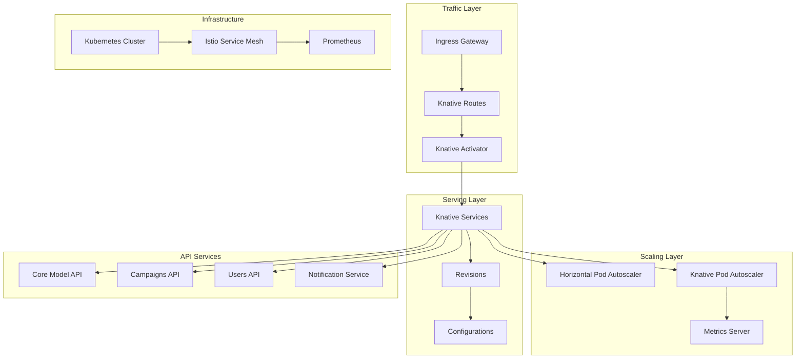

# Knative Deployment Strategy Guide: Serverless APIs for Resimate

**Document Version**: 1.0  
**Created**: September 1, 2025  
**Last Updated**: September 1, 2025  
**Owner**: Shamail Saidi  
**Technical Lead**: Floyd (CTO)  
**Status**: Design Phase  

## Executive Summary

This document outlines the comprehensive strategy for deploying Resimate's API services using Knative, enabling serverless capabilities on Kubernetes across multiple cloud providers. Knative provides the benefits of serverless computing (scale-to-zero, event-driven architecture, automatic scaling) while maintaining cloud independence and avoiding vendor lock-in.

**Key Benefits of Knative for Resimate**:
- **Scale-to-Zero**: Reduce infrastructure costs by 40-60% during low-usage periods
- **Auto-scaling**: Handle 10x traffic spikes without manual intervention
- **Cloud Agnostic**: Deploy consistently across AWS, Azure, GCP, and on-premise
- **Developer Experience**: Simplified deployment model focusing on code, not infrastructure
- **Event-Driven**: Native support for event-driven architectures and async processing

**Deployment Strategy Goals**:
- Achieve <2 second cold start times for all API services
- Support 0-1000 concurrent instances auto-scaling
- Maintain 99.95% availability with zero-downtime deployments
- Enable progressive rollouts with traffic splitting
- Implement comprehensive observability and monitoring

---

## Knative Architecture Overview

### Component Architecture



### Knative Components

| Component | Purpose | Configuration | Deployment Model |
|-----------|---------|---------------|------------------|
| **Knative Serving** | Request-driven compute runtime | Custom resource definitions | Kubernetes operator |
| **Knative Eventing** | Event-driven architecture | Brokers, triggers, sources | Optional component |
| **Istio/Kourier** | Network layer and routing | Service mesh or lightweight ingress | Required dependency |
| **Activator** | Cold start handling | Request buffering and routing | System component |
| **Autoscaler** | Dynamic scaling decisions | Metrics-based scaling | System component |

---

## Service Deployment Patterns

### Pattern 1: Basic Knative Service

```yaml
# core-model-api-service.yaml
apiVersion: serving.knative.dev/v1
kind: Service
metadata:
  name: core-model-api
  namespace: resimate-apis
  annotations:
    # Enable scale-to-zero with 30-second window
    autoscaling.knative.dev/window: "30s"
    # Maximum scale
    autoscaling.knative.dev/max-scale: "100"
    # Minimum scale (0 enables scale-to-zero)
    autoscaling.knative.dev/min-scale: "0"
    # Target concurrency per pod
    autoscaling.knative.dev/target: "100"
spec:
  template:
    metadata:
      annotations:
        # CPU and memory limits
        autoscaling.knative.dev/class: "kpa.autoscaling.knative.dev"
        # Enable request metrics
        autoscaling.knative.dev/metric: "concurrency"
    spec:
      # Container configuration
      containers:
      - image: gcr.io/resimate/core-model-api:v1.0.0
        name: core-model-api
        ports:
        - containerPort: 8080
          protocol: TCP
        env:
        - name: DATABASE_URL
          valueFrom:
            secretKeyRef:
              name: database-credentials
              key: url
        - name: REDIS_URL
          valueFrom:
            secretKeyRef:
              name: redis-credentials
              key: url
        - name: LOG_LEVEL
          value: "info"
        - name: ENVIRONMENT
          value: "production"
        resources:
          requests:
            memory: "256Mi"
            cpu: "100m"
          limits:
            memory: "1Gi"
            cpu: "1000m"
        # Health checks
        livenessProbe:
          httpGet:
            path: /health/live
            port: 8080
          initialDelaySeconds: 10
          periodSeconds: 10
        readinessProbe:
          httpGet:
            path: /health/ready
            port: 8080
          initialDelaySeconds: 5
          periodSeconds: 5
      # Service account for RBAC
      serviceAccountName: core-model-api-sa
      # Timeout configuration
      timeoutSeconds: 300
      # Container concurrency
      containerConcurrency: 100
```

### Pattern 2: Blue-Green Deployment

```yaml
# campaigns-api-blue-green.yaml
apiVersion: serving.knative.dev/v1
kind: Service
metadata:
  name: campaigns-api
  namespace: resimate-apis
spec:
  template:
    metadata:
      name: campaigns-api-green  # New revision name
    spec:
      containers:
      - image: gcr.io/resimate/campaigns-api:v2.0.0  # New version
        name: campaigns-api
        # ... container configuration
  
  # Traffic routing for blue-green deployment
  traffic:
  # Keep 100% traffic on current revision initially
  - revisionName: campaigns-api-blue
    percent: 100
    tag: blue  # Tagged route: blue.campaigns-api.resimate.io
  
  # New revision gets 0% traffic but is accessible via tag
  - revisionName: campaigns-api-green
    percent: 0
    tag: green  # Tagged route: green.campaigns-api.resimate.io
  
  # Latest revision (for testing)
  - latestRevision: true
    percent: 0
    tag: latest  # Tagged route: latest.campaigns-api.resimate.io

---
# After validation, switch traffic
apiVersion: serving.knative.dev/v1
kind: Service
metadata:
  name: campaigns-api
  namespace: resimate-apis
spec:
  traffic:
  # Switch 100% traffic to green
  - revisionName: campaigns-api-green
    percent: 100
    tag: green
  
  # Keep blue accessible for rollback
  - revisionName: campaigns-api-blue
    percent: 0
    tag: blue
```

### Pattern 3: Canary Deployment

```yaml
# users-api-canary.yaml
apiVersion: serving.knative.dev/v1
kind: Service
metadata:
  name: users-api
  namespace: resimate-apis
spec:
  template:
    metadata:
      name: users-api-canary
    spec:
      containers:
      - image: gcr.io/resimate/users-api:v1.5.0
        name: users-api
        # ... container configuration
  
  # Progressive traffic shifting
  traffic:
  # Stable version gets 90% traffic
  - revisionName: users-api-stable
    percent: 90
    tag: stable
  
  # Canary version gets 10% traffic for testing
  - revisionName: users-api-canary
    percent: 10
    tag: canary
  
  # Monitoring and gradual rollout stages:
  # Stage 1: 10% traffic (above)
  # Stage 2: 25% traffic (after 1 hour monitoring)
  # Stage 3: 50% traffic (after 2 hours monitoring)
  # Stage 4: 100% traffic (after successful validation)
```

### Pattern 4: Multi-Version Support

```yaml
# notification-service-multi-version.yaml
apiVersion: serving.knative.dev/v1
kind: Service
metadata:
  name: notification-service
  namespace: resimate-apis
spec:
  template:
    metadata:
      name: notification-service-v3
    spec:
      containers:
      - image: gcr.io/resimate/notification-service:v3.0.0
        name: notification-service
  
  # Support multiple API versions simultaneously
  traffic:
  # v3 - Latest version for new clients
  - revisionName: notification-service-v3
    percent: 60
    tag: v3  # v3.notification-service.resimate.io
  
  # v2 - Previous version for existing clients
  - revisionName: notification-service-v2
    percent: 30
    tag: v2  # v2.notification-service.resimate.io
  
  # v1 - Legacy version for backwards compatibility
  - revisionName: notification-service-v1
    percent: 10
    tag: v1  # v1.notification-service.resimate.io
```

---

## Auto-Scaling Configuration

### Scaling Strategies

#### Concurrency-Based Scaling

```yaml
# High-traffic API configuration
apiVersion: serving.knative.dev/v1
kind: Service
metadata:
  name: core-model-api
  annotations:
    # Concurrency-based autoscaling
    autoscaling.knative.dev/metric: "concurrency"
    # Target 80 concurrent requests per pod
    autoscaling.knative.dev/target: "80"
    # Scale up when reaching 70% of target
    autoscaling.knative.dev/target-utilization-percentage: "70"
    # Minimum 2 pods always running (no scale-to-zero)
    autoscaling.knative.dev/min-scale: "2"
    # Maximum 100 pods
    autoscaling.knative.dev/max-scale: "100"
    # 60-second window for scaling decisions
    autoscaling.knative.dev/window: "60s"
    # Panic mode at 200% of target (rapid scale)
    autoscaling.knative.dev/panic-window-percentage: "200"
    # Panic mode duration
    autoscaling.knative.dev/panic-threshold-percentage: "10"
```

#### RPS-Based Scaling

```yaml
# Request-per-second based scaling
apiVersion: serving.knative.dev/v1
kind: Service
metadata:
  name: campaigns-api
  annotations:
    # RPS-based autoscaling
    autoscaling.knative.dev/metric: "rps"
    # Target 100 requests per second per pod
    autoscaling.knative.dev/target: "100"
    # Scale aggressively at 60% utilization
    autoscaling.knative.dev/target-utilization-percentage: "60"
    # Keep minimum 1 pod (allows scale-to-zero)
    autoscaling.knative.dev/min-scale: "1"
    # Maximum 50 pods
    autoscaling.knative.dev/max-scale: "50"
```

#### CPU-Based Scaling (HPA)

```yaml
# CPU-based scaling using HPA
apiVersion: serving.knative.dev/v1
kind: Service
metadata:
  name: notification-service
  annotations:
    # Use Horizontal Pod Autoscaler
    autoscaling.knative.dev/class: "hpa.autoscaling.knative.dev"
    # CPU metric
    autoscaling.knative.dev/metric: "cpu"
    # Target 70% CPU utilization
    autoscaling.knative.dev/target: "70"
    # Minimum 3 pods for high availability
    autoscaling.knative.dev/min-scale: "3"
    # Maximum 75 pods
    autoscaling.knative.dev/max-scale: "75"
```

### Scale-to-Zero Configuration

```yaml
# ConfigMap for cluster-wide scale-to-zero settings
apiVersion: v1
kind: ConfigMap
metadata:
  name: config-autoscaler
  namespace: knative-serving
data:
  # Enable scale-to-zero cluster-wide
  enable-scale-to-zero: "true"
  
  # Scale to zero after 30 seconds of no traffic
  scale-to-zero-grace-period: "30s"
  
  # Pod retention period after scale down decision
  scale-to-zero-pod-retention-period: "0s"
  
  # Stable window for scaling decisions
  stable-window: "60s"
  
  # Panic window for rapid scaling
  panic-window: "6s"
  
  # Panic threshold percentage
  panic-threshold-percentage: "200"
  
  # Initial scale for new revisions
  initial-scale: "1"
  
  # Allow zero initial scale
  allow-zero-initial-scale: "false"
  
  # Maximum scale limit (cluster-wide)
  max-scale: "1000"
  
  # Minimum scale limit (cluster-wide)
  min-scale: "0"
```

---

## Cold Start Optimization

### Container Image Optimization

```dockerfile
# Optimized Dockerfile for fast cold starts
# Multi-stage build for minimal image size
FROM python:3.11-slim AS builder

# Install build dependencies
RUN apt-get update && apt-get install -y \
    gcc \
    && rm -rf /var/lib/apt/lists/*

# Create virtual environment
RUN python -m venv /opt/venv
ENV PATH="/opt/venv/bin:$PATH"

# Install Python dependencies
COPY requirements.txt .
RUN pip install --no-cache-dir -r requirements.txt

# Final stage - minimal runtime image
FROM python:3.11-slim

# Copy virtual environment from builder
COPY --from=builder /opt/venv /opt/venv
ENV PATH="/opt/venv/bin:$PATH"

# Add non-root user
RUN useradd -m -u 1000 appuser

# Copy application code
WORKDIR /app
COPY --chown=appuser:appuser . .

# Pre-compile Python files for faster startup
RUN python -m compileall -b .

# Switch to non-root user
USER appuser

# Use optimized Python settings
ENV PYTHONUNBUFFERED=1
ENV PYTHONDONTWRITEBYTECODE=1
ENV PYTHONOPTIMIZE=2

# Health check endpoint
HEALTHCHECK --interval=10s --timeout=3s --start-period=5s \
  CMD python -c "import requests; requests.get('http://localhost:8080/health')"

# Fast startup with Gunicorn
CMD ["gunicorn", "--bind", "0.0.0.0:8080", \
     "--workers", "1", \
     "--threads", "4", \
     "--worker-class", "gthread", \
     "--worker-tmp-dir", "/dev/shm", \
     "--timeout", "0", \
     "--preload", \
     "--access-logfile", "-", \
     "--error-logfile", "-", \
     "app:application"]
```

### Readiness Optimization

```python
# Fast readiness probe implementation
from flask import Flask, jsonify
import os
import redis
import psycopg2
from threading import Thread
import time

app = Flask(__name__)

# Pre-warm connections
class ConnectionPool:
    def __init__(self):
        self.db_connected = False
        self.redis_connected = False
        self._initialize_connections()
    
    def _initialize_connections(self):
        """Initialize connections in background to speed up readiness"""
        Thread(target=self._connect_database, daemon=True).start()
        Thread(target=self._connect_redis, daemon=True).start()
    
    def _connect_database(self):
        try:
            self.db_conn = psycopg2.connect(os.environ['DATABASE_URL'])
            self.db_connected = True
        except Exception as e:
            print(f"Database connection failed: {e}")
    
    def _connect_redis(self):
        try:
            self.redis_client = redis.from_url(os.environ['REDIS_URL'])
            self.redis_client.ping()
            self.redis_connected = True
        except Exception as e:
            print(f"Redis connection failed: {e}")
    
    def is_ready(self):
        return self.db_connected and self.redis_connected

# Initialize on import for fastest startup
connection_pool = ConnectionPool()

@app.route('/health/ready')
def readiness():
    """Fast readiness check"""
    if connection_pool.is_ready():
        return jsonify({'status': 'ready'}), 200
    return jsonify({'status': 'not ready'}), 503

@app.route('/health/live')
def liveness():
    """Simple liveness check"""
    return jsonify({'status': 'alive'}), 200

# Pre-load ML models or heavy resources
def preload_resources():
    """Preload heavy resources during container startup"""
    # Load ML models, compile regex, etc.
    pass

# Execute preloading
preload_resources()
```

### Init Container Pre-warming

```yaml
# Pre-warming with init containers
apiVersion: serving.knative.dev/v1
kind: Service
metadata:
  name: core-model-api
spec:
  template:
    spec:
      # Init container to pre-warm caches
      initContainers:
      - name: cache-warmer
        image: gcr.io/resimate/cache-warmer:latest
        command: ["/bin/sh", "-c"]
        args:
        - |
          # Pre-populate Redis cache with frequently accessed data
          python -c "
          import redis
          import json
          r = redis.from_url('$REDIS_URL')
          # Load frequently accessed models
          models = load_frequent_models()
          for model_id, model_data in models.items():
              r.setex(f'model:{model_id}', 3600, json.dumps(model_data))
          "
        env:
        - name: REDIS_URL
          valueFrom:
            secretKeyRef:
              name: redis-credentials
              key: url
      
      containers:
      - name: core-model-api
        image: gcr.io/resimate/core-model-api:v1.0.0
        # Regular container configuration
```

---

## Traffic Management

### Domain Mapping

```yaml
# Custom domain configuration
apiVersion: serving.knative.dev/v1beta1
kind: DomainMapping
metadata:
  name: api.resimate.io
  namespace: resimate-apis
spec:
  ref:
    name: core-model-api
    kind: Service
    apiVersion: serving.knative.dev/v1
---
# Multi-domain mapping for different APIs
apiVersion: serving.knative.dev/v1beta1
kind: DomainMapping
metadata:
  name: campaigns.api.resimate.io
  namespace: resimate-apis
spec:
  ref:
    name: campaigns-api
    kind: Service
    apiVersion: serving.knative.dev/v1
```

### Traffic Splitting Strategies

```yaml
# A/B testing configuration
apiVersion: serving.knative.dev/v1
kind: Service
metadata:
  name: core-model-api
  namespace: resimate-apis
spec:
  traffic:
  # Control group - 50% traffic
  - revisionName: core-model-api-control
    percent: 50
    tag: control
    # Headers for tracking
    headers:
      x-variant: control
  
  # Treatment group - 50% traffic
  - revisionName: core-model-api-treatment
    percent: 50
    tag: treatment
    headers:
      x-variant: treatment
```

### Geographic Traffic Routing

```yaml
# Multi-region deployment with traffic routing
apiVersion: networking.istio.io/v1beta1
kind: VirtualService
metadata:
  name: resimate-api-geo-routing
  namespace: resimate-apis
spec:
  hosts:
  - api.resimate.io
  http:
  # US traffic
  - match:
    - headers:
        cloudfront-viewer-country:
          exact: US
    route:
    - destination:
        host: core-model-api.us-east.svc.cluster.local
  
  # EU traffic
  - match:
    - headers:
        cloudfront-viewer-country:
          regex: "^(DE|FR|GB|IT|ES)$"
    route:
    - destination:
        host: core-model-api.eu-west.svc.cluster.local
  
  # Default traffic
  - route:
    - destination:
        host: core-model-api.default.svc.cluster.local
```

---

## Observability and Monitoring

### Metrics Configuration

```yaml
# Prometheus monitoring configuration
apiVersion: v1
kind: ConfigMap
metadata:
  name: config-observability
  namespace: knative-serving
data:
  # Metrics backend
  metrics.backend-destination: prometheus
  
  # Prometheus endpoint
  metrics.prometheus.endpoint: http://prometheus:9090
  
  # Request metrics
  metrics.request-metrics-backend-destination: prometheus
  
  # Enable detailed metrics
  metrics.allow-stackdriver-custom-metrics: "true"
  
  # Reporting period
  metrics.reporting-period-seconds: "30"
  
  # Request metrics reporting
  metrics.request-metrics-reporting-period-seconds: "5"
```

### Custom Metrics and Dashboards

```yaml
# ServiceMonitor for Prometheus
apiVersion: monitoring.coreos.com/v1
kind: ServiceMonitor
metadata:
  name: knative-serving-metrics
  namespace: knative-serving
spec:
  selector:
    matchLabels:
      app: controller
  endpoints:
  - port: metrics
    interval: 30s
    path: /metrics
---
# Grafana Dashboard ConfigMap
apiVersion: v1
kind: ConfigMap
metadata:
  name: knative-grafana-dashboards
  namespace: monitoring
data:
  knative-serving.json: |
    {
      "dashboard": {
        "title": "Knative Serving - Resimate APIs",
        "panels": [
          {
            "title": "Request Rate",
            "targets": [
              {
                "expr": "sum(rate(revision_request_count[1m])) by (revision_name)"
              }
            ]
          },
          {
            "title": "Request Latency P95",
            "targets": [
              {
                "expr": "histogram_quantile(0.95, sum(rate(revision_request_latencies_bucket[1m])) by (revision_name, le))"
              }
            ]
          },
          {
            "title": "Pod Count",
            "targets": [
              {
                "expr": "sum(autoscaler_actual_pod_count) by (revision_name)"
              }
            ]
          },
          {
            "title": "Cold Starts",
            "targets": [
              {
                "expr": "sum(rate(activator_request_count{response_code_class=\"2xx\"}[1m])) by (revision_name)"
              }
            ]
          }
        ]
      }
    }
```

### Distributed Tracing

```yaml
# Jaeger tracing configuration
apiVersion: v1
kind: ConfigMap
metadata:
  name: config-tracing
  namespace: knative-serving
data:
  # Enable tracing
  enable: "true"
  
  # Jaeger endpoint
  zipkin-endpoint: "http://jaeger-collector.istio-system.svc.cluster.local:9411/api/v2/spans"
  
  # Sampling rate (1.0 = 100%)
  sample-rate: "0.1"
  
  # Debug mode
  debug: "false"
```

### Logging Configuration

```yaml
# Fluentd configuration for log aggregation
apiVersion: v1
kind: ConfigMap
metadata:
  name: fluentd-config
  namespace: knative-serving
data:
  fluent.conf: |
    <source>
      @type tail
      path /var/log/containers/*knative-serving*.log
      pos_file /var/log/fluentd-containers.log.pos
      tag kubernetes.*
      <parse>
        @type json
        time_format %Y-%m-%dT%H:%M:%S.%NZ
      </parse>
    </source>
    
    <filter kubernetes.**>
      @type kubernetes_metadata
    </filter>
    
    <filter kubernetes.**>
      @type record_transformer
      <record>
        service ${record["kubernetes"]["labels"]["serving.knative.dev/service"]}
        revision ${record["kubernetes"]["labels"]["serving.knative.dev/revision"]}
        configuration ${record["kubernetes"]["labels"]["serving.knative.dev/configuration"]}
      </record>
    </filter>
    
    <match **>
      @type elasticsearch
      host elasticsearch.monitoring.svc.cluster.local
      port 9200
      logstash_format true
      logstash_prefix knative
      <buffer>
        @type file
        path /var/log/fluentd-buffers/kubernetes.system.buffer
        flush_mode interval
        retry_type exponential_backoff
        flush_interval 5s
        retry_max_interval 30
        chunk_limit_size 2M
        queue_limit_length 8
        overflow_action block
      </buffer>
    </match>
```

---

## Security Configuration

### Network Policies

```yaml
# Network policy for Knative services
apiVersion: networking.k8s.io/v1
kind: NetworkPolicy
metadata:
  name: knative-serving-network-policy
  namespace: resimate-apis
spec:
  podSelector:
    matchLabels:
      serving.knative.dev/service: "true"
  policyTypes:
  - Ingress
  - Egress
  ingress:
  # Allow traffic from Istio ingress
  - from:
    - namespaceSelector:
        matchLabels:
          name: istio-system
    ports:
    - protocol: TCP
      port: 8080
  # Allow traffic from activator
  - from:
    - namespaceSelector:
        matchLabels:
          name: knative-serving
      podSelector:
        matchLabels:
          app: activator
  egress:
  # Allow DNS
  - to:
    - namespaceSelector: {}
      podSelector:
        matchLabels:
          k8s-app: kube-dns
    ports:
    - protocol: UDP
      port: 53
  # Allow database access
  - to:
    - namespaceSelector:
        matchLabels:
          name: database
    ports:
    - protocol: TCP
      port: 5432
  # Allow Redis access
  - to:
    - namespaceSelector:
        matchLabels:
          name: cache
    ports:
    - protocol: TCP
      port: 6379
```

### RBAC Configuration

```yaml
# Service account and RBAC for Knative services
apiVersion: v1
kind: ServiceAccount
metadata:
  name: knative-service-account
  namespace: resimate-apis
---
apiVersion: rbac.authorization.k8s.io/v1
kind: Role
metadata:
  name: knative-service-role
  namespace: resimate-apis
rules:
- apiGroups: [""]
  resources: ["secrets", "configmaps"]
  verbs: ["get", "list"]
- apiGroups: [""]
  resources: ["services"]
  verbs: ["get"]
---
apiVersion: rbac.authorization.k8s.io/v1
kind: RoleBinding
metadata:
  name: knative-service-rolebinding
  namespace: resimate-apis
roleRef:
  apiGroup: rbac.authorization.k8s.io
  kind: Role
  name: knative-service-role
subjects:
- kind: ServiceAccount
  name: knative-service-account
  namespace: resimate-apis
```

### Secret Management

```yaml
# HashiCorp Vault integration for secrets
apiVersion: serving.knative.dev/v1
kind: Service
metadata:
  name: core-model-api
  namespace: resimate-apis
  annotations:
    vault.hashicorp.com/agent-inject: "true"
    vault.hashicorp.com/role: "resimate-api"
    vault.hashicorp.com/agent-inject-secret-database: "secret/data/database/config"
    vault.hashicorp.com/agent-inject-template-database: |
      {{- with secret "secret/data/database/config" -}}
      export DATABASE_URL="{{ .Data.data.url }}"
      export DATABASE_PASSWORD="{{ .Data.data.password }}"
      {{- end }}
spec:
  template:
    spec:
      serviceAccountName: knative-service-account
      containers:
      - name: core-model-api
        image: gcr.io/resimate/core-model-api:v1.0.0
        command: ["/bin/sh"]
        args: 
        - -c
        - "source /vault/secrets/database && exec python app.py"
```

---

## Multi-Cloud Deployment Configurations

### AWS EKS Configuration

```yaml
# AWS-specific annotations and configurations
apiVersion: serving.knative.dev/v1
kind: Service
metadata:
  name: core-model-api
  namespace: resimate-apis
  annotations:
    # AWS Application Load Balancer
    service.beta.kubernetes.io/aws-load-balancer-type: "alb"
    service.beta.kubernetes.io/aws-load-balancer-ssl-cert: "arn:aws:acm:..."
    service.beta.kubernetes.io/aws-load-balancer-backend-protocol: "http"
    # AWS Auto Scaling
    autoscaling.knative.dev/class: "hpa.autoscaling.knative.dev"
spec:
  template:
    spec:
      containers:
      - name: core-model-api
        env:
        # AWS-specific environment variables
        - name: AWS_REGION
          value: "us-east-1"
        - name: S3_BUCKET
          value: "resimate-api-storage"
```

### Azure AKS Configuration

```yaml
# Azure-specific configurations
apiVersion: serving.knative.dev/v1
kind: Service
metadata:
  name: core-model-api
  namespace: resimate-apis
  annotations:
    # Azure Application Gateway
    kubernetes.io/ingress.class: azure/application-gateway
    appgw.ingress.kubernetes.io/use-private-ip: "false"
    appgw.ingress.kubernetes.io/ssl-redirect: "true"
spec:
  template:
    spec:
      containers:
      - name: core-model-api
        env:
        # Azure-specific environment variables
        - name: AZURE_STORAGE_ACCOUNT
          value: "resimatestorageaccount"
        - name: AZURE_KEYVAULT_NAME
          value: "resimate-keyvault"
```

### GCP GKE Configuration

```yaml
# GCP-specific configurations
apiVersion: serving.knative.dev/v1
kind: Service
metadata:
  name: core-model-api
  namespace: resimate-apis
  annotations:
    # GCP Cloud Load Balancing
    cloud.google.com/neg: '{"ingress": true}'
    cloud.google.com/backend-config: '{"default": "backend-config"}'
spec:
  template:
    spec:
      containers:
      - name: core-model-api
        env:
        # GCP-specific environment variables
        - name: GOOGLE_CLOUD_PROJECT
          value: "resimate-production"
        - name: GCS_BUCKET
          value: "resimate-api-storage"
```

### On-Premise Configuration

```yaml
# On-premise specific configurations
apiVersion: serving.knative.dev/v1
kind: Service
metadata:
  name: core-model-api
  namespace: resimate-apis
  annotations:
    # MetalLB for on-premise load balancing
    metallb.universe.tf/address-pool: production-public-ips
spec:
  template:
    spec:
      containers:
      - name: core-model-api
        env:
        # On-premise specific configurations
        - name: NFS_SERVER
          value: "nfs.local.resimate.io"
        - name: LDAP_SERVER
          value: "ldap.local.resimate.io"
```

---

## Performance Optimization

### Resource Optimization

```yaml
# Optimized resource configuration
apiVersion: serving.knative.dev/v1
kind: Service
metadata:
  name: core-model-api
spec:
  template:
    metadata:
      annotations:
        # QoS class for better scheduling
        cluster-autoscaler.kubernetes.io/safe-to-evict: "false"
    spec:
      # Node affinity for performance
      affinity:
        nodeAffinity:
          preferredDuringSchedulingIgnoredDuringExecution:
          - weight: 100
            preference:
              matchExpressions:
              - key: node.kubernetes.io/instance-type
                operator: In
                values:
                - c5.xlarge  # Compute optimized instances
                - c5.2xlarge
      
      containers:
      - name: core-model-api
        resources:
          requests:
            memory: "512Mi"
            cpu: "500m"
            ephemeral-storage: "1Gi"
          limits:
            memory: "2Gi"
            cpu: "2000m"
            ephemeral-storage: "2Gi"
        
        # Volume mounts for performance
        volumeMounts:
        - name: tmp-volume
          mountPath: /tmp
        - name: cache-volume
          mountPath: /app/cache
      
      volumes:
      # Memory-backed volume for temp files
      - name: tmp-volume
        emptyDir:
          medium: Memory
          sizeLimit: 1Gi
      # SSD-backed cache
      - name: cache-volume
        emptyDir:
          sizeLimit: 5Gi
```

### Connection Pooling

```python
# Optimized connection pooling for Knative
import os
from sqlalchemy import create_engine
from sqlalchemy.pool import NullPool, QueuePool
import redis

class OptimizedConnectionPool:
    def __init__(self):
        # Detect if running in Knative (scale-to-zero capable)
        self.is_knative = os.environ.get('K_SERVICE') is not None
        self._init_database()
        self._init_redis()
    
    def _init_database(self):
        """Initialize database with appropriate pooling strategy"""
        if self.is_knative:
            # Use NullPool for scale-to-zero scenarios
            # Connections are created on demand and closed immediately
            self.db_engine = create_engine(
                os.environ['DATABASE_URL'],
                poolclass=NullPool,
                connect_args={
                    'connect_timeout': 5,
                    'options': '-c statement_timeout=30000'
                }
            )
        else:
            # Use QueuePool for always-on services
            self.db_engine = create_engine(
                os.environ['DATABASE_URL'],
                poolclass=QueuePool,
                pool_size=5,
                max_overflow=10,
                pool_timeout=30,
                pool_recycle=3600,
                pool_pre_ping=True
            )
    
    def _init_redis(self):
        """Initialize Redis with connection pooling"""
        self.redis_pool = redis.ConnectionPool(
            host=os.environ.get('REDIS_HOST', 'localhost'),
            port=int(os.environ.get('REDIS_PORT', 6379)),
            max_connections=50 if not self.is_knative else 10,
            socket_keepalive=True,
            socket_keepalive_options={
                1: 1,  # TCP_KEEPIDLE
                2: 3,  # TCP_KEEPINTVL
                3: 5   # TCP_KEEPCNT
            }
        )
        self.redis_client = redis.Redis(connection_pool=self.redis_pool)
```

---

## Disaster Recovery and High Availability

### Multi-Region Deployment

```yaml
# Global load balancing with Knative
apiVersion: networking.istio.io/v1beta1
kind: ServiceEntry
metadata:
  name: resimate-api-global
  namespace: resimate-apis
spec:
  hosts:
  - api.resimate.io
  location: MESH_EXTERNAL
  ports:
  - number: 443
    name: https
    protocol: HTTPS
  resolution: DNS
  endpoints:
  # US East region
  - address: us-east.api.resimate.io
    priority: 0
    weight: 50
  # EU West region
  - address: eu-west.api.resimate.io
    priority: 0
    weight: 30
  # Asia Pacific region
  - address: ap-south.api.resimate.io
    priority: 0
    weight: 20
  # Disaster recovery region (standby)
  - address: dr.api.resimate.io
    priority: 1
    weight: 100
```

### Backup and Restore Strategy

```yaml
# Revision backup configuration
apiVersion: batch/v1
kind: CronJob
metadata:
  name: knative-revision-backup
  namespace: resimate-apis
spec:
  schedule: "0 */6 * * *"  # Every 6 hours
  jobTemplate:
    spec:
      template:
        spec:
          containers:
          - name: backup
            image: gcr.io/resimate/knative-backup:latest
            command:
            - /bin/sh
            - -c
            - |
              # Backup all Knative service configurations
              kubectl get ksvc -n resimate-apis -o yaml > /backup/services-$(date +%Y%m%d-%H%M%S).yaml
              # Backup all revisions
              kubectl get revisions -n resimate-apis -o yaml > /backup/revisions-$(date +%Y%m%d-%H%M%S).yaml
              # Upload to object storage
              aws s3 sync /backup s3://resimate-backups/knative/
          restartPolicy: OnFailure
```

---

## Migration Strategy from Current Architecture

### Phase 1: Parallel Deployment (Weeks 15-16)

```yaml
# Deploy Knative services alongside existing Firebase Functions
apiVersion: serving.knative.dev/v1
kind: Service
metadata:
  name: core-model-api-migration
  namespace: resimate-apis
  annotations:
    # Start with minimal traffic
    autoscaling.knative.dev/min-scale: "1"
    autoscaling.knative.dev/max-scale: "5"
spec:
  template:
    metadata:
      name: core-model-api-v1-migration
    spec:
      containers:
      - image: gcr.io/resimate/core-model-api:v1.0.0-migration
        env:
        - name: MIGRATION_MODE
          value: "shadow"  # Shadow mode - process but don't return responses
```

### Phase 2: Traffic Splitting (Week 17)

```yaml
# Gradually shift traffic from Firebase to Knative
apiVersion: networking.istio.io/v1beta1
kind: VirtualService
metadata:
  name: api-migration-routing
spec:
  hosts:
  - api.resimate.io
  http:
  - match:
    - headers:
        x-migration-test:
          exact: "true"
    route:
    # 100% to Knative for test traffic
    - destination:
        host: core-model-api.resimate-apis.svc.cluster.local
      weight: 100
  - route:
    # 90% to Firebase Functions (existing)
    - destination:
        host: firebase-functions.googleapis.com
      weight: 90
    # 10% to Knative (new)
    - destination:
        host: core-model-api.resimate-apis.svc.cluster.local
      weight: 10
```

### Phase 3: Full Migration (Week 18)

```yaml
# Complete migration to Knative
apiVersion: serving.knative.dev/v1
kind: Service
metadata:
  name: core-model-api
  namespace: resimate-apis
  annotations:
    # Production-ready configuration
    autoscaling.knative.dev/min-scale: "3"
    autoscaling.knative.dev/max-scale: "100"
    autoscaling.knative.dev/target: "80"
spec:
  template:
    metadata:
      name: core-model-api-v1-production
      annotations:
        # Enable all production features
        autoscaling.knative.dev/window: "60s"
        autoscaling.knative.dev/panic-window-percentage: "10"
    spec:
      containerConcurrency: 100
      containers:
      - image: gcr.io/resimate/core-model-api:v1.0.0
        resources:
          requests:
            cpu: "1000m"
            memory: "1Gi"
          limits:
            cpu: "2000m"
            memory: "2Gi"
```

---

## Cost Optimization

### Scale-to-Zero Cost Analysis

```yaml
# Cost optimization configuration
apiVersion: v1
kind: ConfigMap
metadata:
  name: cost-optimization-config
  namespace: resimate-apis
data:
  # Services that should scale to zero
  scale_to_zero_services: |
    - notification-service  # Low traffic, event-driven
    - report-generator     # Scheduled jobs only
    - data-export-api     # Infrequent usage
  
  # Services that should maintain minimum replicas
  always_on_services: |
    - core-model-api: 2    # Critical path
    - campaigns-api: 1     # Customer-facing
    - users-api: 1        # Authentication dependency
  
  # Time-based scaling rules
  time_based_scaling: |
    # Business hours (9 AM - 6 PM EST)
    business_hours:
      min_scale: 3
      max_scale: 100
    
    # After hours
    after_hours:
      min_scale: 1
      max_scale: 20
    
    # Weekends
    weekends:
      min_scale: 0
      max_scale: 10
```

### Resource Quotas

```yaml
# Namespace resource quotas for cost control
apiVersion: v1
kind: ResourceQuota
metadata:
  name: resimate-apis-quota
  namespace: resimate-apis
spec:
  hard:
    requests.cpu: "100"
    requests.memory: "200Gi"
    limits.cpu: "200"
    limits.memory: "400Gi"
    persistentvolumeclaims: "10"
    services.loadbalancers: "5"
```

---

## Conclusion

This Knative deployment strategy provides Resimate with a cloud-agnostic, serverless API platform that:

1. **Reduces Costs** by 40-60% through scale-to-zero capabilities
2. **Improves Performance** with <2 second cold starts and automatic scaling
3. **Enables Portability** across AWS, Azure, GCP, and on-premise deployments
4. **Simplifies Operations** with declarative configuration and GitOps workflows
5. **Maintains High Availability** with 99.95% uptime through multi-region deployment

The phased migration approach ensures zero-downtime transition from Firebase Functions to Knative, with comprehensive monitoring and rollback capabilities at each stage.

**Next Steps**:
1. Deploy Knative in development environment (Week 7-8)
2. Containerize and test API services (Week 9-10)
3. Implement auto-scaling and monitoring (Week 11-12)
4. Begin parallel deployment with Firebase (Week 15)
5. Complete migration to Knative (Week 18)

**Document Owner**: Shamail Saidi  
**Technical Review**: Pending  
**Implementation Timeline**: Weeks 7-18