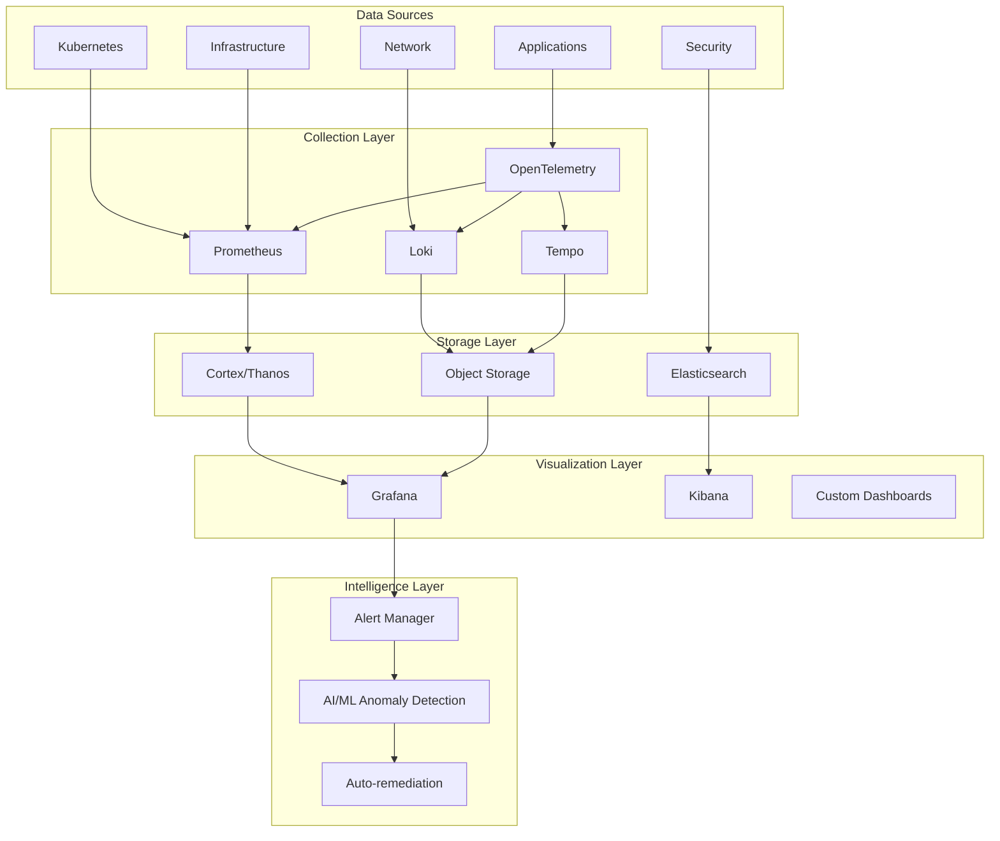
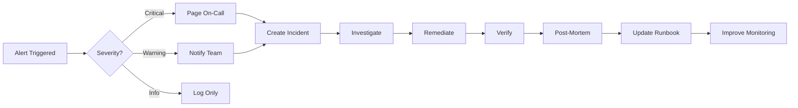

# Monitoring and Observability Strategy: Resimate Platform

**Document Version**: 1.0  
**Created**: September 1, 2025  
**Last Updated**: September 1, 2025  
**Owner**: Shamail Saidi  
**Technical Lead**: Floyd (CTO)  
**Status**: Design Phase  

## Executive Summary

This document outlines the comprehensive monitoring and observability strategy for Resimate's cloud-agnostic platform, implementing the three pillars of observability (metrics, logs, traces) with a focus on proactive monitoring, rapid incident detection, and data-driven optimization.

**Observability Goals**:
- **Complete Visibility**: End-to-end visibility across all components
- **Proactive Detection**: Identify issues before customer impact  
- **Rapid Resolution**: MTTR < 30 minutes for critical issues
- **Performance Optimization**: Data-driven capacity planning
- **Compliance**: Audit trail and regulatory compliance

---

## Observability Architecture



---

## Metrics Strategy

### Metrics Collection Architecture

```yaml
# Prometheus Configuration
global:
  scrape_interval: 15s
  evaluation_interval: 15s
  external_labels:
    cluster: 'production'
    region: 'us-east-1'
    environment: 'prod'

# Scrape Configurations
scrape_configs:
  # Kubernetes Service Discovery
  - job_name: 'kubernetes-pods'
    kubernetes_sd_configs:
    - role: pod
    relabel_configs:
    - source_labels: [__meta_kubernetes_pod_annotation_prometheus_io_scrape]
      action: keep
      regex: true
    - source_labels: [__meta_kubernetes_pod_annotation_prometheus_io_path]
      action: replace
      target_label: __metrics_path__
      regex: (.+)
    
  # Node Exporter
  - job_name: 'node-exporter'
    kubernetes_sd_configs:
    - role: node
    
  # Knative Metrics
  - job_name: 'knative'
    kubernetes_sd_configs:
    - role: pod
      namespaces:
        names: ['knative-serving']
```

### Key Performance Indicators (KPIs)

| Category | Metric | Target | Alert Threshold |
|----------|--------|---------|-----------------|
| **Availability** | Uptime | 99.95% | < 99.9% |
| **Performance** | API Response Time (P95) | < 200ms | > 500ms |
| **Performance** | API Response Time (P99) | < 500ms | > 1000ms |
| **Throughput** | Requests per Second | > 1000 | < 100 |
| **Error Rate** | HTTP Error Rate | < 0.1% | > 1% |
| **Saturation** | CPU Utilization | < 70% | > 80% |
| **Saturation** | Memory Utilization | < 80% | > 90% |

### Application Metrics

```python
# Python Application Metrics Example
from prometheus_client import Counter, Histogram, Gauge, Summary
import time

# Request metrics
request_count = Counter('app_requests_total', 
                       'Total requests',
                       ['method', 'endpoint', 'status'])

request_duration = Histogram('app_request_duration_seconds',
                            'Request duration',
                            ['method', 'endpoint'])

# Business metrics
active_users = Gauge('app_active_users',
                    'Currently active users')

model_calculations = Counter('model_calculations_total',
                           'Total model calculations',
                           ['model_type', 'tenant'])

calculation_time = Summary('model_calculation_duration_seconds',
                         'Model calculation time',
                         ['model_type'])

# Database metrics
db_connections = Gauge('db_connections_active',
                      'Active database connections')

query_duration = Histogram('db_query_duration_seconds',
                         'Database query duration',
                         ['query_type'])

# Usage example
@request_duration.time()
@request_count.count_exceptions()
def process_request(method, endpoint):
    request_count.labels(method=method, endpoint=endpoint, status='200').inc()
    # Process request
    return response
```

### Infrastructure Metrics

```yaml
# Node and Cluster Metrics
infrastructure_metrics:
  node_metrics:
    - node_cpu_seconds_total
    - node_memory_MemAvailable_bytes
    - node_filesystem_avail_bytes
    - node_network_receive_bytes_total
    - node_network_transmit_bytes_total
  
  kubernetes_metrics:
    - kube_pod_container_resource_requests
    - kube_pod_container_resource_limits
    - kube_deployment_status_replicas_available
    - kube_node_status_condition
    - kube_persistentvolume_status_phase
  
  database_metrics:
    - pg_stat_database_numbackends
    - pg_stat_database_tup_fetched
    - pg_stat_database_conflicts
    - pg_stat_replication_lag
  
  cache_metrics:
    - redis_connected_clients
    - redis_used_memory_bytes
    - redis_commands_processed_total
    - redis_keyspace_hits_total
```

---

## Logging Strategy

### Structured Logging Format

```json
{
  "timestamp": "2025-09-01T12:00:00.000Z",
  "level": "INFO",
  "service": "core-model-api",
  "version": "1.0.0",
  "trace_id": "abc123def456",
  "span_id": "789ghi012",
  "user_id": "user_12345",
  "tenant_id": "tenant_67890",
  "method": "POST",
  "path": "/api/v1/models",
  "status_code": 200,
  "duration_ms": 45,
  "message": "Model calculation completed successfully",
  "metadata": {
    "model_type": "resilience",
    "calculation_time": 23,
    "cache_hit": false
  }
}
```

### Log Aggregation with Loki

```yaml
# Loki Configuration
auth_enabled: false

server:
  http_listen_port: 3100
  grpc_listen_port: 9096

ingester:
  wal:
    enabled: true
    dir: /loki/wal
  lifecycler:
    address: 127.0.0.1
    ring:
      kvstore:
        store: inmemory
      replication_factor: 1

schema_config:
  configs:
    - from: 2025-01-01
      store: boltdb-shipper
      object_store: s3
      schema: v11
      index:
        prefix: index_
        period: 24h

storage_config:
  boltdb_shipper:
    active_index_directory: /loki/boltdb-shipper-active
    cache_location: /loki/boltdb-shipper-cache
    shared_store: s3
  aws:
    s3: s3://us-east-1/resimate-logs
    region: us-east-1

limits_config:
  enforce_metric_name: false
  reject_old_samples: true
  reject_old_samples_max_age: 168h
  ingestion_rate_mb: 10
  ingestion_burst_size_mb: 20
```

### Log Retention and Rotation

| Log Type | Retention Period | Storage Location | Compression |
|----------|------------------|------------------|-------------|
| **Application Logs** | 30 days | Loki/S3 | gzip |
| **Audit Logs** | 7 years | Encrypted S3 | gzip |
| **Security Logs** | 1 year | SIEM | lz4 |
| **Debug Logs** | 7 days | Local/Loki | snappy |
| **Access Logs** | 90 days | Loki/S3 | gzip |

---

## Distributed Tracing

### OpenTelemetry Implementation

```python
# OpenTelemetry Setup
from opentelemetry import trace
from opentelemetry.exporter.otlp.proto.grpc.trace_exporter import OTLPSpanExporter
from opentelemetry.sdk.trace import TracerProvider
from opentelemetry.sdk.trace.export import BatchSpanProcessor
from opentelemetry.instrumentation.flask import FlaskInstrumentor
from opentelemetry.instrumentation.requests import RequestsInstrumentor
from opentelemetry.instrumentation.sqlalchemy import SQLAlchemyInstrumentor

# Configure tracer
trace.set_tracer_provider(TracerProvider())
tracer = trace.get_tracer(__name__)

# Configure OTLP exporter
otlp_exporter = OTLPSpanExporter(
    endpoint="tempo-collector:4317",
    insecure=True
)

# Add span processor
span_processor = BatchSpanProcessor(otlp_exporter)
trace.get_tracer_provider().add_span_processor(span_processor)

# Auto-instrument libraries
FlaskInstrumentor().instrument_app(app)
RequestsInstrumentor().instrument()
SQLAlchemyInstrumentor().instrument(engine=db_engine)

# Manual instrumentation example
@app.route('/api/calculate')
def calculate():
    with tracer.start_as_current_span("calculate_model") as span:
        span.set_attribute("model.type", "resilience")
        span.set_attribute("user.id", current_user.id)
        
        # Database operation
        with tracer.start_as_current_span("fetch_data"):
            data = fetch_model_data()
        
        # Calculation
        with tracer.start_as_current_span("perform_calculation"):
            result = calculate_resilience(data)
        
        span.set_attribute("calculation.result", result)
        return jsonify(result)
```

### Trace Sampling Strategy

```yaml
# Sampling Configuration
sampling:
  # Head-based sampling
  head_sampling:
    default_rate: 0.1  # 10% of traces
    
    # Increased sampling for errors
    error_rate: 1.0  # 100% of error traces
    
    # Route-based sampling
    routes:
      /health: 0.001  # 0.1% for health checks
      /api/critical: 0.5  # 50% for critical APIs
      /api/: 0.1  # 10% for regular APIs
  
  # Tail-based sampling (in collector)
  tail_sampling:
    policies:
      - name: errors-policy
        type: status_code
        status_codes: [ERROR]
        sampling_percentage: 100
      
      - name: latency-policy
        type: latency
        threshold_ms: 1000
        sampling_percentage: 100
      
      - name: probabilistic-policy
        type: probabilistic
        sampling_percentage: 10
```

---

## Alerting Strategy

### Alert Rules Configuration

```yaml
# Prometheus Alert Rules
groups:
  - name: application_alerts
    interval: 30s
    rules:
      - alert: HighErrorRate
        expr: |
          (
            sum(rate(app_requests_total{status=~"5.."}[5m]))
            /
            sum(rate(app_requests_total[5m]))
          ) > 0.01
        for: 5m
        labels:
          severity: critical
          team: backend
        annotations:
          summary: "High error rate detected"
          description: "Error rate is {{ $value | humanizePercentage }} for the last 5 minutes"
      
      - alert: SlowAPIResponse
        expr: |
          histogram_quantile(0.95,
            sum(rate(app_request_duration_seconds_bucket[5m])) by (le, endpoint)
          ) > 0.5
        for: 10m
        labels:
          severity: warning
          team: backend
        annotations:
          summary: "Slow API response time"
          description: "P95 response time for {{ $labels.endpoint }} is {{ $value }}s"
      
      - alert: PodMemoryUsage
        expr: |
          (
            container_memory_working_set_bytes
            / 
            container_spec_memory_limit_bytes
          ) > 0.9
        for: 5m
        labels:
          severity: warning
          team: platform
        annotations:
          summary: "High memory usage in pod"
          description: "Pod {{ $labels.pod }} memory usage is {{ $value | humanizePercentage }}"
```

### Alert Routing and Escalation

```yaml
# AlertManager Configuration
global:
  resolve_timeout: 5m
  smtp_from: 'alerts@resimate.io'
  smtp_smarthost: 'smtp.sendgrid.net:587'
  smtp_auth_username: 'apikey'
  smtp_auth_password: '${SENDGRID_API_KEY}'

route:
  group_by: ['alertname', 'cluster', 'service']
  group_wait: 10s
  group_interval: 10s
  repeat_interval: 1h
  receiver: 'default'
  
  routes:
    # Critical alerts - immediate page
    - match:
        severity: critical
      receiver: pagerduty
      continue: true
    
    # Warning alerts - email/slack
    - match:
        severity: warning
      receiver: slack
      continue: true
    
    # Database alerts
    - match:
        service: database
      receiver: dba-team
    
    # Security alerts
    - match_re:
        alertname: ^Security.*
      receiver: security-team

receivers:
  - name: 'default'
    email_configs:
      - to: 'ops-team@resimate.io'
  
  - name: 'pagerduty'
    pagerduty_configs:
      - service_key: '${PAGERDUTY_SERVICE_KEY}'
        severity: 'critical'
  
  - name: 'slack'
    slack_configs:
      - api_url: '${SLACK_WEBHOOK_URL}'
        channel: '#alerts'
        title: 'Alert: {{ .GroupLabels.alertname }}'
  
  - name: 'dba-team'
    email_configs:
      - to: 'dba@resimate.io'
  
  - name: 'security-team'
    email_configs:
      - to: 'security@resimate.io'
```

---

## Dashboards and Visualization

### Grafana Dashboard Structure

```yaml
# Dashboard Organization
dashboards:
  # Executive Dashboard
  executive:
    - name: "Business Overview"
      panels:
        - active_users
        - revenue_metrics
        - system_health
        - sla_compliance
    
    - name: "SLA Dashboard"
      panels:
        - uptime_percentage
        - response_time_trends
        - error_rates
        - availability_by_region
  
  # Operations Dashboard
  operations:
    - name: "System Health"
      panels:
        - cluster_overview
        - pod_status
        - resource_utilization
        - network_traffic
    
    - name: "Application Performance"
      panels:
        - request_rate
        - response_times
        - error_distribution
        - slow_queries
  
  # Security Dashboard
  security:
    - name: "Security Overview"
      panels:
        - authentication_attempts
        - failed_logins
        - suspicious_activity
        - compliance_status
  
  # Cost Dashboard
  cost:
    - name: "Cloud Costs"
      panels:
        - cost_by_service
        - cost_trends
        - resource_efficiency
        - cost_anomalies
```

### Custom Dashboard Examples

```json
{
  "dashboard": {
    "title": "Resimate API Performance",
    "panels": [
      {
        "title": "Request Rate",
        "type": "graph",
        "targets": [
          {
            "expr": "sum(rate(app_requests_total[5m])) by (endpoint)",
            "legendFormat": "{{ endpoint }}"
          }
        ]
      },
      {
        "title": "Response Time Heatmap",
        "type": "heatmap",
        "targets": [
          {
            "expr": "sum(rate(app_request_duration_seconds_bucket[5m])) by (le)",
            "format": "heatmap"
          }
        ]
      },
      {
        "title": "Error Rate",
        "type": "stat",
        "targets": [
          {
            "expr": "sum(rate(app_requests_total{status=~\"5..\"}[5m])) / sum(rate(app_requests_total[5m])) * 100"
          }
        ],
        "thresholds": {
          "mode": "absolute",
          "steps": [
            {"color": "green", "value": null},
            {"color": "yellow", "value": 0.5},
            {"color": "red", "value": 1}
          ]
        }
      }
    ]
  }
}
```

---

## SLIs, SLOs, and Error Budgets

### Service Level Indicators (SLIs)

```yaml
# SLI Definitions
slis:
  availability:
    definition: "Percentage of successful requests"
    formula: "(1 - (failed_requests / total_requests)) * 100"
    measurement_window: 5m
  
  latency:
    definition: "95th percentile response time"
    formula: "histogram_quantile(0.95, request_duration_seconds)"
    measurement_window: 5m
  
  error_rate:
    definition: "Percentage of 5xx errors"
    formula: "(errors_5xx / total_requests) * 100"
    measurement_window: 5m
  
  throughput:
    definition: "Requests processed per second"
    formula: "rate(requests_total[1m])"
    measurement_window: 1m
```

### Service Level Objectives (SLOs)

| Service | SLI | SLO Target | Error Budget |
|---------|-----|------------|--------------|
| **Core API** | Availability | 99.95% | 21.6 min/month |
| **Core API** | Latency P95 | < 200ms | 5% violations |
| **Core API** | Error Rate | < 0.1% | 0.1% |
| **Campaigns API** | Availability | 99.9% | 43.2 min/month |
| **Campaigns API** | Latency P95 | < 500ms | 5% violations |
| **Database** | Availability | 99.99% | 4.32 min/month |
| **Database** | Query Time P95 | < 100ms | 5% violations |

### Error Budget Tracking

```yaml
# Error Budget Policy
error_budget_policy:
  calculation:
    window: 30d  # Rolling 30-day window
    formula: "1 - (actual_availability / slo_target)"
  
  thresholds:
    healthy: "> 50%"  # More than 50% budget remaining
    warning: "25-50%"  # Slow down feature releases
    critical: "< 25%"  # Feature freeze
    exhausted: "< 0%"  # Incident declaration
  
  actions:
    warning:
      - notify_team
      - increase_testing
      - review_recent_changes
    
    critical:
      - feature_freeze
      - focus_on_reliability
      - daily_standup
    
    exhausted:
      - incident_response
      - postmortem_required
      - executive_escalation
```

---

## Anomaly Detection and AI/ML

### Anomaly Detection Configuration

```python
# Anomaly Detection with Prophet
from fbprophet import Prophet
import pandas as pd

class AnomalyDetector:
    def __init__(self, metric_name, threshold=0.95):
        self.metric_name = metric_name
        self.threshold = threshold
        self.model = Prophet(
            interval_width=threshold,
            seasonality_mode='multiplicative'
        )
    
    def train(self, historical_data):
        """Train model on historical data"""
        df = pd.DataFrame({
            'ds': historical_data['timestamp'],
            'y': historical_data['value']
        })
        self.model.fit(df)
    
    def detect_anomalies(self, current_value, timestamp):
        """Detect if current value is anomalous"""
        future = pd.DataFrame({'ds': [timestamp]})
        forecast = self.model.predict(future)
        
        lower_bound = forecast['yhat_lower'].iloc[0]
        upper_bound = forecast['yhat_upper'].iloc[0]
        
        if current_value < lower_bound or current_value > upper_bound:
            return True, {
                'expected_range': [lower_bound, upper_bound],
                'actual_value': current_value,
                'deviation': abs(current_value - forecast['yhat'].iloc[0])
            }
        
        return False, None
```

### Predictive Monitoring

```yaml
# Predictive Monitoring Rules
predictive_monitoring:
  capacity_planning:
    - metric: disk_usage
      model: linear_regression
      forecast_window: 30d
      alert_threshold: 80%
    
    - metric: memory_growth
      model: exponential_smoothing
      forecast_window: 7d
      alert_threshold: 90%
  
  performance_degradation:
    - metric: response_time
      model: change_point_detection
      sensitivity: high
      alert_on: significant_increase
  
  traffic_prediction:
    - metric: request_rate
      model: sarima
      seasonality: daily, weekly
      use_for: auto_scaling
```

---

## Compliance and Audit Monitoring

### Compliance Monitoring

```yaml
# Compliance Monitoring Configuration
compliance_monitoring:
  gdpr:
    - data_access_logs:
        retention: 7_years
        encryption: required
        audit_fields: [user_id, data_accessed, purpose, timestamp]
    
    - consent_tracking:
        monitor: consent_changes
        alert_on: consent_withdrawn
    
    - data_retention:
        monitor: data_age
        alert_on: exceeded_retention_period
  
  hipaa:
    - phi_access:
        log_all: true
        alert_on: unauthorized_access
        audit_trail: immutable
    
    - encryption_status:
        monitor: encryption_enabled
        alert_on: unencrypted_phi
  
  soc2:
    - change_management:
        log_all_changes: true
        require_approval: true
        audit_trail: complete
    
    - access_reviews:
        frequency: quarterly
        alert_on: overdue_review
```

---

## Cost Monitoring

### Cloud Cost Tracking

```yaml
# Cost Monitoring Configuration
cost_monitoring:
  metrics:
    - cloud_compute_cost_hourly
    - cloud_storage_cost_daily
    - cloud_network_egress_cost
    - cloud_database_cost
  
  alerts:
    - name: cost_spike
      condition: "daily_cost > (avg_daily_cost * 1.5)"
      severity: warning
    
    - name: budget_exceeded
      condition: "monthly_cost > monthly_budget"
      severity: critical
  
  optimization:
    - unused_resources:
        check_frequency: daily
        auto_cleanup: true
    
    - right_sizing:
        analyze_frequency: weekly
        recommendation_threshold: 20%_savings
```

---

## Monitoring Tools Integration

### Multi-Cloud Monitoring Integration

| Cloud | Native Monitoring | Integration Method | Metrics Export |
|-------|------------------|-------------------|----------------|
| **AWS** | CloudWatch | CloudWatch Exporter | Prometheus |
| **Azure** | Azure Monitor | Azure Monitor Exporter | Prometheus |
| **GCP** | Cloud Monitoring | Stackdriver Exporter | Prometheus |
| **On-Prem** | Native Prometheus | Direct | Native |

---

## Incident Response Integration

### Incident Management Workflow



---

## Conclusion

This monitoring and observability strategy provides comprehensive visibility into Resimate's platform through:

1. **Three Pillars of Observability**: Metrics, logs, and traces
2. **Proactive Monitoring**: Anomaly detection and predictive analytics
3. **Rapid Resolution**: Automated alerting and incident response
4. **Compliance**: Audit trails and regulatory monitoring
5. **Cost Optimization**: Cloud cost tracking and optimization

The strategy ensures operational excellence and maintains high service quality across all deployment environments.

**Document Owner**: Shamail Saidi  
**Review Schedule**: Quarterly  
**Next Review**: December 1, 2025  
**Distribution**: Operations, Engineering, Security Teams