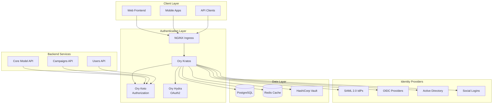
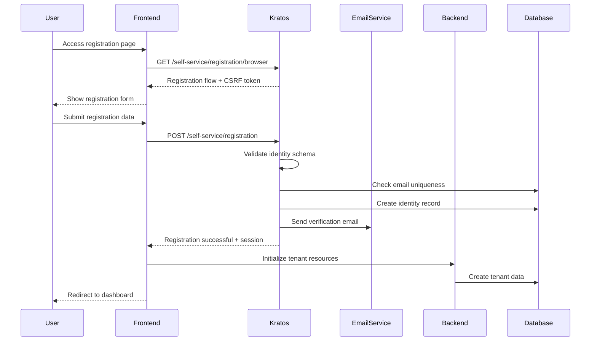
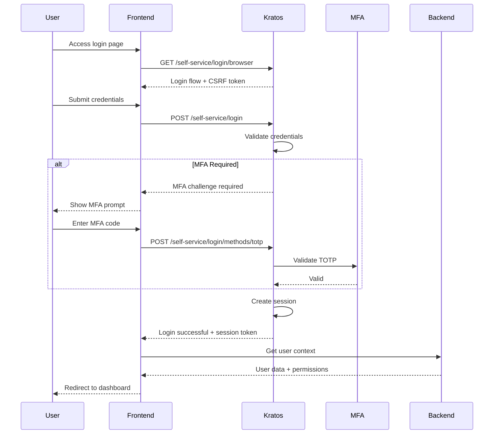
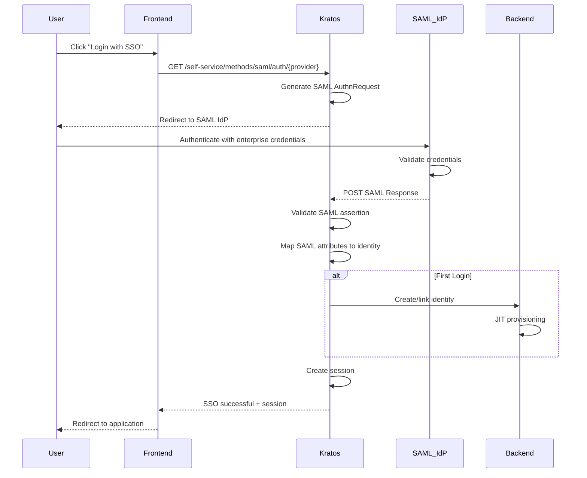
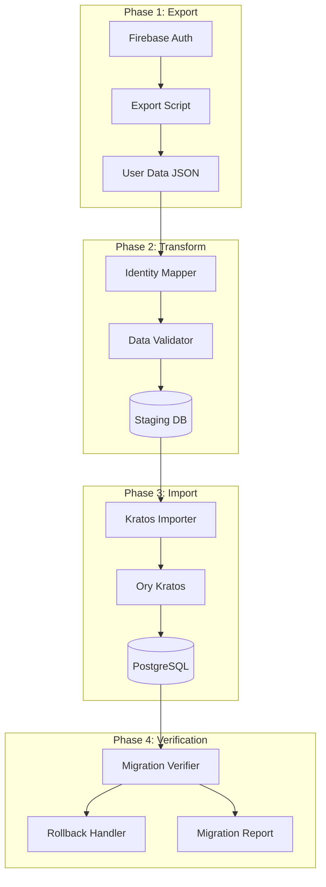

# Ory Kratos Integration Design: Resimate Authentication Architecture

**Document Version**: 1.0  
**Created**: September 1, 2025  
**Last Updated**: September 1, 2025  
**Owner**: Shamail Saidi  
**Technical Lead**: Floyd (CTO)  
**Status**: Design Phase  

## Executive Summary

This document provides a comprehensive design for integrating Ory Kratos as the authentication and identity management system for Resimate's cloud-agnostic architecture. The design covers Firebase Auth migration, identity schema definition, authentication flows, and integration patterns for enterprise deployments.

**Key Design Decisions**:
- Replace Firebase Auth with Ory Kratos for cloud-agnostic authentication
- Implement federated identity support for enterprise SSO
- Zero-downtime migration strategy with parallel operation phase
- Custom identity schema supporting multi-tenancy
- Self-hosted deployment for data sovereignty compliance

**Integration Goals**:
- Seamless migration of 10,000+ existing Firebase Auth users
- Support for SAML 2.0, OIDC, and Active Directory integration
- Sub-100ms authentication response times
- 99.99% authentication service availability
- Complete audit trail for compliance requirements

---

## Architecture Overview

### High-Level Authentication Architecture



### Component Responsibilities

| Component | Responsibility | Technology | Deployment Model |
|-----------|---------------|------------|------------------|
| **Ory Kratos** | Identity management, authentication | Go-based service | Kubernetes StatefulSet |
| **Ory Keto** | Fine-grained authorization | Go-based service | Kubernetes Deployment |
| **Ory Hydra** | OAuth 2.0/OIDC server | Go-based service | Kubernetes Deployment |
| **PostgreSQL** | Identity data persistence | PostgreSQL 15+ | Managed/Operator |
| **Redis** | Session cache, rate limiting | Redis 7+ | Kubernetes StatefulSet |
| **HashiCorp Vault** | Secrets, encryption keys | Vault 1.14+ | Kubernetes StatefulSet |

---

## Identity Schema Design

### Resimate Identity Schema

```json
{
  "$id": "https://schemas.resimate.io/identity.schema.json",
  "$schema": "http://json-schema.org/draft-07/schema#",
  "title": "Resimate User Identity",
  "type": "object",
  "properties": {
    "traits": {
      "type": "object",
      "properties": {
        "email": {
          "type": "string",
          "format": "email",
          "title": "Email Address",
          "ory.sh/kratos": {
            "credentials": {
              "password": {
                "identifier": true
              },
              "webauthn": {
                "identifier": true
              }
            },
            "recovery": {
              "via": "email"
            },
            "verification": {
              "via": "email"
            }
          }
        },
        "username": {
          "type": "string",
          "title": "Username",
          "minLength": 3,
          "maxLength": 32,
          "pattern": "^[a-zA-Z0-9_-]+$"
        },
        "name": {
          "type": "object",
          "properties": {
            "first": {
              "type": "string",
              "title": "First Name",
              "minLength": 1,
              "maxLength": 256
            },
            "last": {
              "type": "string",
              "title": "Last Name",
              "minLength": 1,
              "maxLength": 256
            }
          },
          "required": ["first", "last"]
        },
        "tenant": {
          "type": "object",
          "properties": {
            "id": {
              "type": "string",
              "title": "Tenant ID",
              "format": "uuid"
            },
            "name": {
              "type": "string",
              "title": "Tenant Name"
            },
            "role": {
              "type": "string",
              "title": "Tenant Role",
              "enum": ["owner", "admin", "member", "viewer"]
            }
          },
          "required": ["id", "role"]
        },
        "profile": {
          "type": "object",
          "properties": {
            "avatar_url": {
              "type": "string",
              "format": "uri"
            },
            "department": {
              "type": "string"
            },
            "job_title": {
              "type": "string"
            },
            "phone": {
              "type": "string"
            },
            "timezone": {
              "type": "string",
              "default": "UTC"
            },
            "locale": {
              "type": "string",
              "default": "en-US"
            }
          }
        },
        "metadata": {
          "type": "object",
          "properties": {
            "firebase_uid": {
              "type": "string",
              "title": "Legacy Firebase UID"
            },
            "migration_date": {
              "type": "string",
              "format": "date-time"
            },
            "created_at": {
              "type": "string",
              "format": "date-time"
            },
            "last_login": {
              "type": "string",
              "format": "date-time"
            },
            "login_count": {
              "type": "integer",
              "minimum": 0
            }
          }
        },
        "compliance": {
          "type": "object",
          "properties": {
            "gdpr_consent": {
              "type": "boolean",
              "default": false
            },
            "gdpr_consent_date": {
              "type": "string",
              "format": "date-time"
            },
            "data_retention_period": {
              "type": "string",
              "enum": ["30d", "90d", "1y", "7y", "indefinite"],
              "default": "7y"
            },
            "data_classification": {
              "type": "string",
              "enum": ["public", "internal", "confidential", "restricted"],
              "default": "internal"
            }
          }
        }
      },
      "required": ["email", "name", "tenant"],
      "additionalProperties": false
    }
  }
}
```

### Multi-Tenancy Implementation

#### Tenant Isolation Strategy

```yaml
# Keto namespace configuration for tenant isolation
namespaces:
  - id: 0
    name: tenants
    relations:
      - name: owner
        subject_set:
          namespace: 0
          object: ""
          relation: ""
      - name: admin
        subject_set:
          namespace: 0
          object: ""
          relation: ""
      - name: member
        subject_set:
          namespace: 0
          object: ""
          relation: ""
      - name: viewer
        subject_set:
          namespace: 0
          object: ""
          relation: ""

  - id: 1
    name: resources
    relations:
      - name: read
        union:
          - tenant#viewer
          - tenant#member
          - tenant#admin
          - tenant#owner
      - name: write
        union:
          - tenant#member
          - tenant#admin
          - tenant#owner
      - name: delete
        union:
          - tenant#admin
          - tenant#owner
```

---

## Authentication Flows

### Registration Flow



### Login Flow with MFA



### SSO Integration Flow (SAML 2.0)



---

## Firebase Auth Migration Strategy

### Migration Architecture



### Migration Implementation

#### Phase 1: Firebase Export Script

```python
# firebase_export.py
import firebase_admin
from firebase_admin import auth, credentials
import json
from datetime import datetime
import hashlib

class FirebaseAuthExporter:
    def __init__(self, service_account_path):
        cred = credentials.Certificate(service_account_path)
        firebase_admin.initialize_app(cred)
        
    def export_users(self, batch_size=1000):
        """Export all Firebase Auth users in batches"""
        all_users = []
        page = auth.list_users()
        
        while page:
            for user in page.users:
                user_data = {
                    'firebase_uid': user.uid,
                    'email': user.email,
                    'email_verified': user.email_verified,
                    'display_name': user.display_name,
                    'photo_url': user.photo_url,
                    'phone_number': user.phone_number,
                    'disabled': user.disabled,
                    'metadata': {
                        'creation_time': user.user_metadata.creation_timestamp,
                        'last_sign_in': user.user_metadata.last_sign_in_timestamp,
                        'last_refresh': user.user_metadata.last_refresh_timestamp
                    },
                    'custom_claims': user.custom_claims or {},
                    'provider_data': [
                        {
                            'provider_id': p.provider_id,
                            'uid': p.uid,
                            'email': p.email
                        } for p in user.provider_data
                    ],
                    'password_hash': user.password_hash,
                    'password_salt': user.password_salt
                }
                all_users.append(user_data)
                
            page = page.get_next_page()
            
        return all_users
    
    def export_to_file(self, output_path='firebase_users.json'):
        """Export users to JSON file with checksums"""
        users = self.export_users()
        
        export_data = {
            'export_timestamp': datetime.utcnow().isoformat(),
            'total_users': len(users),
            'users': users,
            'checksum': hashlib.sha256(
                json.dumps(users, sort_keys=True).encode()
            ).hexdigest()
        }
        
        with open(output_path, 'w') as f:
            json.dump(export_data, f, indent=2, default=str)
            
        return export_data['checksum']
```

#### Phase 2: Identity Mapping

```python
# identity_mapper.py
from datetime import datetime
import uuid
import json

class IdentityMapper:
    def __init__(self, tenant_mapping_file=None):
        self.tenant_mappings = {}
        if tenant_mapping_file:
            with open(tenant_mapping_file) as f:
                self.tenant_mappings = json.load(f)
    
    def map_firebase_to_kratos(self, firebase_user):
        """Map Firebase user to Kratos identity schema"""
        
        # Parse display name
        display_name = firebase_user.get('display_name', '')
        name_parts = display_name.split(' ', 1) if display_name else ['', '']
        first_name = name_parts[0] or 'Unknown'
        last_name = name_parts[1] if len(name_parts) > 1 else 'User'
        
        # Determine tenant from custom claims or email domain
        tenant_id = self._determine_tenant(firebase_user)
        
        # Build Kratos identity
        kratos_identity = {
            'schema_id': 'https://schemas.resimate.io/identity.schema.json',
            'state': 'active' if not firebase_user.get('disabled') else 'inactive',
            'traits': {
                'email': firebase_user['email'],
                'username': self._generate_username(firebase_user),
                'name': {
                    'first': first_name,
                    'last': last_name
                },
                'tenant': {
                    'id': tenant_id,
                    'name': self.tenant_mappings.get(tenant_id, {}).get('name', 'Default'),
                    'role': self._determine_role(firebase_user)
                },
                'profile': {
                    'avatar_url': firebase_user.get('photo_url', ''),
                    'phone': firebase_user.get('phone_number', ''),
                    'timezone': 'UTC',
                    'locale': 'en-US'
                },
                'metadata': {
                    'firebase_uid': firebase_user['firebase_uid'],
                    'migration_date': datetime.utcnow().isoformat(),
                    'created_at': firebase_user['metadata'].get('creation_time'),
                    'last_login': firebase_user['metadata'].get('last_sign_in'),
                    'login_count': 0
                },
                'compliance': {
                    'gdpr_consent': True,  # Assume consent for existing users
                    'gdpr_consent_date': datetime.utcnow().isoformat(),
                    'data_retention_period': '7y',
                    'data_classification': 'internal'
                }
            },
            'verifiable_addresses': [
                {
                    'via': 'email',
                    'value': firebase_user['email'],
                    'verified': firebase_user.get('email_verified', False),
                    'status': 'completed' if firebase_user.get('email_verified') else 'pending'
                }
            ],
            'recovery_addresses': [
                {
                    'via': 'email',
                    'value': firebase_user['email']
                }
            ]
        }
        
        # Handle password migration
        if firebase_user.get('password_hash'):
            kratos_identity['credentials'] = {
                'password': {
                    'config': {
                        'hashed_password': self._convert_password_hash(
                            firebase_user['password_hash'],
                            firebase_user.get('password_salt')
                        )
                    }
                }
            }
        
        return kratos_identity
    
    def _determine_tenant(self, firebase_user):
        """Determine tenant ID from user data"""
        # Check custom claims first
        custom_claims = firebase_user.get('custom_claims', {})
        if 'tenant_id' in custom_claims:
            return custom_claims['tenant_id']
        
        # Fallback to email domain mapping
        email = firebase_user.get('email', '')
        domain = email.split('@')[1] if '@' in email else 'default'
        
        # Map domain to tenant or create new
        if domain in self.tenant_mappings:
            return self.tenant_mappings[domain]['id']
        
        # Generate new tenant ID for unknown domain
        return str(uuid.uuid4())
    
    def _determine_role(self, firebase_user):
        """Determine user role from custom claims"""
        custom_claims = firebase_user.get('custom_claims', {})
        return custom_claims.get('role', 'member')
    
    def _generate_username(self, firebase_user):
        """Generate username from email or display name"""
        email = firebase_user.get('email', '')
        if email:
            return email.split('@')[0].lower()
        return f"user_{firebase_user['firebase_uid'][:8]}"
    
    def _convert_password_hash(self, hash_value, salt):
        """Convert Firebase password hash to Kratos format"""
        # Firebase uses scrypt, Kratos supports argon2, bcrypt, pbkdf2
        # This requires password reset for security
        return {
            'algorithm': 'firebase_scrypt',
            'hash': hash_value,
            'salt': salt,
            'requires_reset': True
        }
```

#### Phase 3: Kratos Import

```python
# kratos_importer.py
import requests
import json
from typing import List, Dict
import time

class KratosImporter:
    def __init__(self, kratos_admin_url: str, api_key: str = None):
        self.admin_url = kratos_admin_url
        self.headers = {'Content-Type': 'application/json'}
        if api_key:
            self.headers['Authorization'] = f'Bearer {api_key}'
        self.session = requests.Session()
        self.session.headers.update(self.headers)
    
    def import_identities(self, identities: List[Dict], batch_size: int = 100):
        """Import identities to Kratos in batches"""
        results = {
            'successful': [],
            'failed': [],
            'total': len(identities)
        }
        
        for i in range(0, len(identities), batch_size):
            batch = identities[i:i + batch_size]
            batch_results = self._import_batch(batch)
            results['successful'].extend(batch_results['successful'])
            results['failed'].extend(batch_results['failed'])
            
            # Rate limiting
            time.sleep(1)
            
            # Progress reporting
            progress = (i + len(batch)) / len(identities) * 100
            print(f"Import progress: {progress:.1f}%")
        
        return results
    
    def _import_batch(self, batch: List[Dict]):
        """Import a batch of identities"""
        batch_results = {'successful': [], 'failed': []}
        
        for identity in batch:
            try:
                response = self.session.post(
                    f'{self.admin_url}/admin/identities',
                    json=identity
                )
                
                if response.status_code == 201:
                    created_identity = response.json()
                    batch_results['successful'].append({
                        'firebase_uid': identity['traits']['metadata']['firebase_uid'],
                        'kratos_id': created_identity['id'],
                        'email': identity['traits']['email']
                    })
                else:
                    batch_results['failed'].append({
                        'firebase_uid': identity['traits']['metadata']['firebase_uid'],
                        'email': identity['traits']['email'],
                        'error': response.text,
                        'status_code': response.status_code
                    })
            except Exception as e:
                batch_results['failed'].append({
                    'firebase_uid': identity['traits']['metadata'].get('firebase_uid'),
                    'email': identity['traits'].get('email'),
                    'error': str(e)
                })
        
        return batch_results
    
    def verify_import(self, expected_count: int):
        """Verify the import was successful"""
        response = self.session.get(f'{self.admin_url}/admin/identities')
        
        if response.status_code == 200:
            identities = response.json()
            actual_count = len(identities)
            
            return {
                'success': actual_count >= expected_count,
                'expected': expected_count,
                'actual': actual_count,
                'difference': actual_count - expected_count
            }
        
        return {
            'success': False,
            'error': response.text
        }
```

### Migration Execution Plan

#### Timeline and Phases

| Phase | Duration | Activities | Risk Level |
|-------|----------|------------|------------|
| **Preparation** | 1 week | Export scripts, data validation, backup | Low |
| **Test Migration** | 1 week | Test environment migration, validation | Medium |
| **Parallel Operation** | 2 weeks | Both systems active, sync users | High |
| **Cutover** | 4 hours | Switch to Kratos, monitor | Critical |
| **Cleanup** | 1 week | Remove Firebase dependencies | Low |

#### Rollback Strategy

```yaml
rollback_triggers:
  - authentication_failure_rate: "> 1%"
  - response_time_degradation: "> 50%"
  - data_inconsistency_detected: true
  - critical_bug_found: true

rollback_procedure:
  1_immediate:
    - revert_dns_changes
    - restore_firebase_auth_routing
    - notify_incident_team
  
  2_assessment:
    - analyze_failure_root_cause
    - validate_firebase_auth_health
    - confirm_user_access_restored
  
  3_recovery:
    - sync_data_changes_during_cutover
    - prepare_retry_migration_plan
    - communicate_with_stakeholders
```

---

## Integration Patterns

### Frontend Integration

#### React/Next.js SDK Integration

```typescript
// kratos-client.ts
import { Configuration, FrontendApi, Identity, Session } from '@ory/kratos-client'

export class KratosClient {
  private api: FrontendApi
  private sessionCheckInterval: NodeJS.Timeout | null = null
  
  constructor(basePath: string = process.env.NEXT_PUBLIC_KRATOS_URL!) {
    this.api = new FrontendApi(
      new Configuration({
        basePath,
        baseOptions: {
          withCredentials: true
        }
      })
    )
  }
  
  async getCurrentSession(): Promise<Session | null> {
    try {
      const { data } = await this.api.toSession()
      return data
    } catch (error) {
      return null
    }
  }
  
  async login(email: string, password: string): Promise<Session> {
    // Initialize login flow
    const { data: flow } = await this.api.createBrowserLoginFlow()
    
    // Submit credentials
    const { data: session } = await this.api.updateLoginFlow({
      flow: flow.id,
      updateLoginFlowBody: {
        method: 'password',
        identifier: email,
        password: password,
        csrf_token: flow.ui.nodes.find(
          n => n.attributes.name === 'csrf_token'
        )?.attributes.value
      }
    })
    
    return session
  }
  
  async logout(): Promise<void> {
    const { data: flow } = await this.api.createBrowserLogoutFlow()
    await this.api.updateLogoutFlow({
      token: flow.logout_token
    })
  }
  
  async register(email: string, password: string, firstName: string, lastName: string): Promise<Session> {
    // Initialize registration flow
    const { data: flow } = await this.api.createBrowserRegistrationFlow()
    
    // Submit registration
    const { data: result } = await this.api.updateRegistrationFlow({
      flow: flow.id,
      updateRegistrationFlowBody: {
        method: 'password',
        traits: {
          email,
          name: {
            first: firstName,
            last: lastName
          }
        },
        password,
        csrf_token: flow.ui.nodes.find(
          n => n.attributes.name === 'csrf_token'
        )?.attributes.value
      }
    })
    
    return result.session
  }
  
  startSessionCheck(callback: (session: Session | null) => void, interval: number = 60000): void {
    this.sessionCheckInterval = setInterval(async () => {
      const session = await this.getCurrentSession()
      callback(session)
    }, interval)
  }
  
  stopSessionCheck(): void {
    if (this.sessionCheckInterval) {
      clearInterval(this.sessionCheckInterval)
      this.sessionCheckInterval = null
    }
  }
}

// React Hook
export function useKratosSession() {
  const [session, setSession] = useState<Session | null>(null)
  const [loading, setLoading] = useState(true)
  const kratosClient = useMemo(() => new KratosClient(), [])
  
  useEffect(() => {
    // Initial session check
    kratosClient.getCurrentSession().then(session => {
      setSession(session)
      setLoading(false)
    })
    
    // Start periodic checks
    kratosClient.startSessionCheck(setSession)
    
    return () => {
      kratosClient.stopSessionCheck()
    }
  }, [kratosClient])
  
  return { session, loading, kratosClient }
}
```

### Backend Integration

#### Python/Flask Middleware

```python
# kratos_middleware.py
from functools import wraps
from flask import request, jsonify, g
import requests
from typing import Optional, Dict, List
import jwt
from cachetools import TTLCache

class KratosMiddleware:
    def __init__(self, kratos_public_url: str, kratos_admin_url: str):
        self.public_url = kratos_public_url
        self.admin_url = kratos_admin_url
        self.session_cache = TTLCache(maxsize=1000, ttl=300)  # 5-minute cache
        
    def verify_session(self, cookie: str = None, token: str = None) -> Optional[Dict]:
        """Verify Kratos session via cookie or token"""
        
        # Check cache first
        cache_key = cookie or token
        if cache_key in self.session_cache:
            return self.session_cache[cache_key]
        
        headers = {}
        if cookie:
            headers['Cookie'] = cookie
        elif token:
            headers['Authorization'] = f'Bearer {token}'
        else:
            return None
            
        try:
            response = requests.get(
                f'{self.public_url}/sessions/whoami',
                headers=headers,
                timeout=5
            )
            
            if response.status_code == 200:
                session = response.json()
                self.session_cache[cache_key] = session
                return session
                
        except requests.RequestException:
            pass
            
        return None
    
    def require_auth(self, required_roles: List[str] = None):
        """Decorator for protecting endpoints"""
        def decorator(f):
            @wraps(f)
            def decorated_function(*args, **kwargs):
                # Extract session from cookie or Authorization header
                cookie = request.headers.get('Cookie')
                token = request.headers.get('Authorization', '').replace('Bearer ', '')
                
                session = self.verify_session(cookie, token)
                
                if not session:
                    return jsonify({'error': 'Unauthorized'}), 401
                
                # Store session in g for use in endpoint
                g.kratos_session = session
                g.user_id = session['identity']['id']
                g.user_email = session['identity']['traits']['email']
                g.tenant_id = session['identity']['traits']['tenant']['id']
                g.user_role = session['identity']['traits']['tenant']['role']
                
                # Check required roles if specified
                if required_roles:
                    user_role = g.user_role
                    if user_role not in required_roles:
                        return jsonify({'error': 'Forbidden'}), 403
                
                return f(*args, **kwargs)
            
            return decorated_function
        return decorator
    
    def get_identity(self, identity_id: str) -> Optional[Dict]:
        """Get full identity details from admin API"""
        try:
            response = requests.get(
                f'{self.admin_url}/admin/identities/{identity_id}',
                timeout=5
            )
            
            if response.status_code == 200:
                return response.json()
                
        except requests.RequestException:
            pass
            
        return None

# Flask app integration
from flask import Flask

app = Flask(__name__)
kratos = KratosMiddleware(
    kratos_public_url='http://kratos-public:4433',
    kratos_admin_url='http://kratos-admin:4434'
)

@app.route('/api/profile')
@kratos.require_auth()
def get_profile():
    """Example protected endpoint"""
    return jsonify({
        'user_id': g.user_id,
        'email': g.user_email,
        'tenant_id': g.tenant_id,
        'role': g.user_role
    })

@app.route('/api/admin/users')
@kratos.require_auth(required_roles=['admin', 'owner'])
def list_users():
    """Admin-only endpoint"""
    # Implementation here
    pass
```

---

## Security Considerations

### Session Management

#### Session Configuration

```yaml
# kratos-config.yml
session:
  cookie:
    name: resimate_session
    same_site: Lax
    path: /
    http_only: true
    secure: true  # HTTPS only
    domain: .resimate.io
  
  lifespan: 24h
  earliest_possible_extend: 1h
  
  whoami:
    required_aal: aal1
    tokenizer:
      templates:
        jwks_url: https://resimate.io/.well-known/jwks.json
```

#### Rate Limiting

```yaml
# Rate limiting configuration
rate_limits:
  login_attempts:
    max_attempts: 5
    window: 15m
    lockout_duration: 30m
  
  registration:
    max_per_ip: 10
    window: 1h
  
  password_reset:
    max_per_email: 3
    window: 1h
  
  api_requests:
    authenticated: 1000/hour
    unauthenticated: 100/hour
```

### Compliance Features

#### Audit Logging

```yaml
# Audit log configuration
audit:
  enabled: true
  
  events:
    - user.login.success
    - user.login.failure
    - user.logout
    - user.registration
    - user.password.reset
    - user.email.verification
    - user.mfa.enabled
    - user.mfa.disabled
    - session.extended
    - session.revoked
  
  storage:
    type: postgres
    retention_days: 2555  # 7 years for compliance
    
  export:
    format: json
    encryption: true
```

#### Data Privacy

```yaml
# Privacy configuration
privacy:
  # GDPR compliance
  gdpr:
    enabled: true
    consent_required: true
    data_export_enabled: true
    data_deletion_enabled: true
    retention_period: 7y
  
  # Data anonymization
  anonymization:
    enabled: true
    fields:
      - ip_address
      - user_agent
      - device_fingerprint
  
  # PII encryption
  pii_encryption:
    enabled: true
    algorithm: AES-256-GCM
    key_rotation: 90d
```

---

## Monitoring and Observability

### Metrics Collection

```yaml
# Prometheus metrics
metrics:
  - name: kratos_login_attempts_total
    type: counter
    labels: [status, method]
    
  - name: kratos_registration_total
    type: counter
    labels: [status]
    
  - name: kratos_session_duration_seconds
    type: histogram
    buckets: [60, 300, 900, 3600, 86400]
    
  - name: kratos_mfa_usage_total
    type: counter
    labels: [method, status]
    
  - name: kratos_identity_count
    type: gauge
    labels: [tenant_id, status]
```

### Health Checks

```yaml
# Kubernetes health probes
livenessProbe:
  httpGet:
    path: /health/alive
    port: 4434
  initialDelaySeconds: 30
  periodSeconds: 10

readinessProbe:
  httpGet:
    path: /health/ready
    port: 4434
  initialDelaySeconds: 5
  periodSeconds: 5
```

---

## Deployment Configuration

### Kubernetes Manifests

```yaml
# kratos-deployment.yaml
apiVersion: apps/v1
kind: Deployment
metadata:
  name: kratos
  namespace: auth
spec:
  replicas: 3
  selector:
    matchLabels:
      app: kratos
  template:
    metadata:
      labels:
        app: kratos
    spec:
      containers:
      - name: kratos
        image: oryd/kratos:v1.0.0
        ports:
        - containerPort: 4433
          name: public
        - containerPort: 4434
          name: admin
        env:
        - name: DSN
          valueFrom:
            secretKeyRef:
              name: kratos-secrets
              key: dsn
        - name: SECRETS_COOKIE
          valueFrom:
            secretKeyRef:
              name: kratos-secrets
              key: cookie-secret
        - name: SECRETS_CIPHER
          valueFrom:
            secretKeyRef:
              name: kratos-secrets
              key: cipher-secret
        volumeMounts:
        - name: kratos-config
          mountPath: /etc/config/kratos
        resources:
          requests:
            memory: "128Mi"
            cpu: "100m"
          limits:
            memory: "512Mi"
            cpu: "500m"
        livenessProbe:
          httpGet:
            path: /health/alive
            port: 4434
          initialDelaySeconds: 30
          periodSeconds: 10
        readinessProbe:
          httpGet:
            path: /health/ready
            port: 4434
          initialDelaySeconds: 5
          periodSeconds: 5
      volumes:
      - name: kratos-config
        configMap:
          name: kratos-config
---
apiVersion: v1
kind: Service
metadata:
  name: kratos-public
  namespace: auth
spec:
  selector:
    app: kratos
  ports:
  - port: 4433
    targetPort: 4433
    name: public
---
apiVersion: v1
kind: Service
metadata:
  name: kratos-admin
  namespace: auth
spec:
  selector:
    app: kratos
  ports:
  - port: 4434
    targetPort: 4434
    name: admin
```

### Multi-Cloud Considerations

| Cloud Provider | Implementation Details | Considerations |
|----------------|------------------------|----------------|
| **AWS** | EKS deployment, RDS PostgreSQL, Secrets Manager | IAM role integration |
| **Azure** | AKS deployment, Azure Database, Key Vault | Azure AD integration |
| **GCP** | GKE deployment, Cloud SQL, Secret Manager | Workload Identity |
| **On-Premise** | Self-managed K8s, PostgreSQL Operator, Vault | Network security |

---

## Testing Strategy

### Unit Tests

```python
# test_kratos_integration.py
import pytest
from unittest.mock import Mock, patch
from kratos_middleware import KratosMiddleware

class TestKratosMiddleware:
    @pytest.fixture
    def middleware(self):
        return KratosMiddleware(
            kratos_public_url='http://localhost:4433',
            kratos_admin_url='http://localhost:4434'
        )
    
    def test_verify_session_valid(self, middleware):
        with patch('requests.get') as mock_get:
            mock_get.return_value.status_code = 200
            mock_get.return_value.json.return_value = {
                'id': 'session-123',
                'identity': {
                    'id': 'user-456',
                    'traits': {
                        'email': 'test@example.com'
                    }
                }
            }
            
            session = middleware.verify_session(cookie='valid-cookie')
            assert session is not None
            assert session['identity']['traits']['email'] == 'test@example.com'
    
    def test_verify_session_invalid(self, middleware):
        with patch('requests.get') as mock_get:
            mock_get.return_value.status_code = 401
            
            session = middleware.verify_session(cookie='invalid-cookie')
            assert session is None
    
    def test_session_caching(self, middleware):
        with patch('requests.get') as mock_get:
            mock_get.return_value.status_code = 200
            mock_get.return_value.json.return_value = {'id': 'cached-session'}
            
            # First call - should hit API
            session1 = middleware.verify_session(cookie='test-cookie')
            assert mock_get.call_count == 1
            
            # Second call - should use cache
            session2 = middleware.verify_session(cookie='test-cookie')
            assert mock_get.call_count == 1  # No additional API call
            assert session1 == session2
```

### Integration Tests

```typescript
// kratos-integration.test.ts
import { KratosClient } from './kratos-client'
import nock from 'nock'

describe('KratosClient Integration', () => {
  let client: KratosClient
  
  beforeEach(() => {
    client = new KratosClient('http://localhost:4433')
  })
  
  afterEach(() => {
    nock.cleanAll()
  })
  
  describe('login', () => {
    it('should successfully login with valid credentials', async () => {
      // Mock flow initialization
      nock('http://localhost:4433')
        .get('/self-service/login/browser')
        .reply(200, {
          id: 'flow-123',
          ui: {
            nodes: [
              { attributes: { name: 'csrf_token', value: 'token-456' } }
            ]
          }
        })
      
      // Mock login submission
      nock('http://localhost:4433')
        .post('/self-service/login', {
          flow: 'flow-123',
          method: 'password',
          identifier: 'test@example.com',
          password: 'password123',
          csrf_token: 'token-456'
        })
        .reply(200, {
          session: {
            id: 'session-789',
            identity: {
              id: 'user-123',
              traits: { email: 'test@example.com' }
            }
          }
        })
      
      const session = await client.login('test@example.com', 'password123')
      expect(session.id).toBe('session-789')
      expect(session.identity.traits.email).toBe('test@example.com')
    })
    
    it('should handle login failure', async () => {
      nock('http://localhost:4433')
        .get('/self-service/login/browser')
        .reply(200, { id: 'flow-123', ui: { nodes: [] } })
      
      nock('http://localhost:4433')
        .post('/self-service/login')
        .reply(400, {
          error: {
            id: 'bad_credentials',
            message: 'Invalid credentials'
          }
        })
      
      await expect(
        client.login('test@example.com', 'wrong-password')
      ).rejects.toThrow('Invalid credentials')
    })
  })
})
```

---

## Conclusion

This Ory Kratos integration design provides a comprehensive blueprint for migrating from Firebase Auth to a cloud-agnostic authentication system. The design ensures:

1. **Zero-downtime migration** through parallel operation and gradual cutover
2. **Enterprise readiness** with SSO, MFA, and compliance features
3. **Multi-cloud compatibility** across AWS, Azure, GCP, and on-premise
4. **Performance parity** with sub-100ms authentication operations
5. **Complete audit trail** for regulatory compliance

The implementation will proceed through careful phases with extensive testing and rollback capabilities at each stage. Success will be measured by maintaining 100% user access during migration and achieving all performance and compliance targets.

**Next Steps**:
1. Review and approve identity schema design
2. Set up test environment for migration validation
3. Develop and test migration scripts
4. Plan parallel operation period
5. Execute phased migration with monitoring

**Document Owner**: Shamail Saidi  
**Technical Review**: Pending  
**Implementation Timeline**: Weeks 15-18